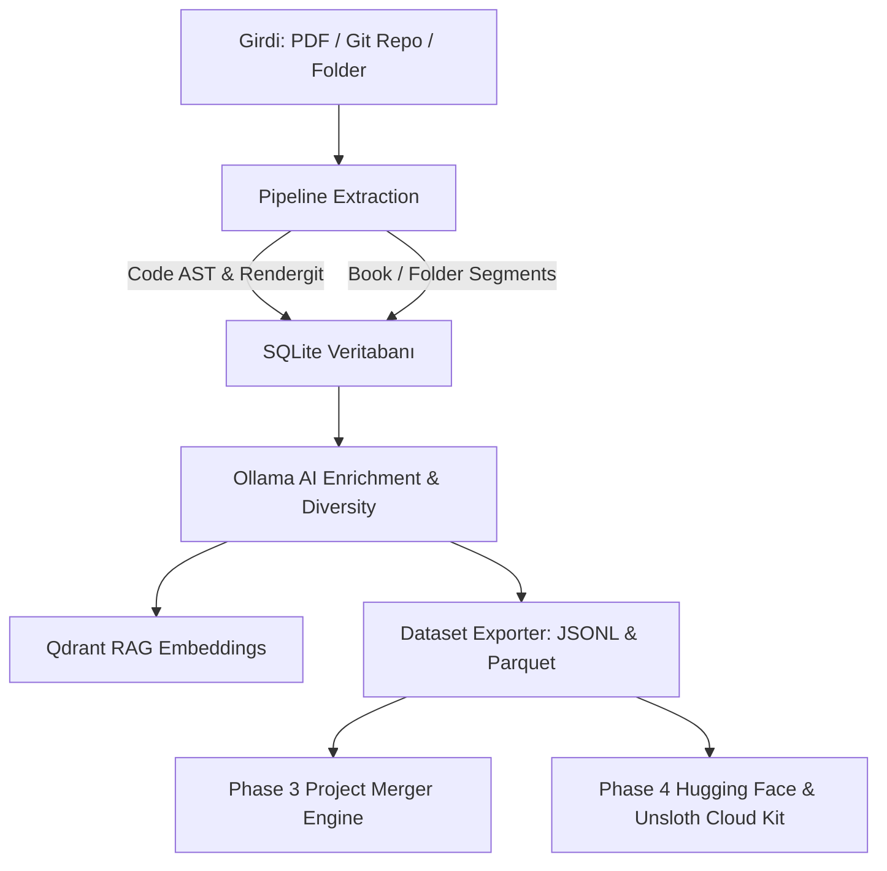

# ⚡ Elektor Universal Pipeline Mimari & Sistem Kılavuzu

Bu klasör (`.antigravity/`), Elektor Sentetik Veri & RAG Platformu projesinin sistem mimarisini, veri akışını ve modüler yapısını tanımlayan güncel teknik referans dokümanını içerir.

---

## 🏗️ 1. Boru Hattı Mimarısı (Pipeline Architecture)

Sistem 4 ana aşamadan (Phase 1-4) oluşur ve PDF dökümanları ile Git kaynak kod depolarını yüksek kaliteli LLM fine-tuning veri setlerine (SFT, DPO, Multi-turn Chat, Code SFT) dönüştürür.

---

## 🛠️ 2. Temel Modüller & Sorumluluklar

| Dosya / Dizin | Sorumluluk |
| :--- | :--- |
| **`api_server.py`** | FastAPI tabanlı backend sunucusu. Proje yönetimi, pipeline tetikleme, RAG sorgulama, proje birleştirme ve HF/Cloud endpoints. |
| **`run.py`** | Birleşik komut satırı arayüzü (CLI). `extract`, `enrich`, `embed`, `export`, `merge` ve `server` komutları. |
| **`pipeline/extractor.py`** | PDF döküman ayrıştırma, sayfa dilimleme ve SQLite metadata indeksleme. |
| **`pipeline/code_extractor.py`** | `rendergit` mimarisi ile Git depolarını düzleştirme ve AST (Abstract Syntax Tree) kod birimlerini ayıklama. |
| **`pipeline/analyzer.py`** | Ollama LLM zenginleştirme motoru. 4 sentetik kod kategorisi (`explanation`, `completion`, `bug_fix`, `unit_test`) üretimi. |
| **`pipeline/vector_store.py`** | Kelime sınırı korumalı chunking ve Qdrant RAG vektör indeksleme. |
| **`pipeline/dataset_builder.py`** | JSONL ve Parquet formatında SFT, DPO, Chat ve Code SFT veri seti ihracı. |
| **`pipeline/project_merger.py`** | Faz 3 Güvenli Proje ve Veri Seti Birleştirme Motoru (Dry-Run Audit + Atomic SQLite/JSONL Merge). |
| **`pipeline/hf_deployer.py`** | Faz 4 Hugging Face Hub otomatik yükleyici ve denetleyicisi. |
| **`pipeline/cloud_gpu_offloader.py`** | Faz 4 JupyterLab (`http://192.168.1.14:8888/lab`) ve Unsloth/Axolotl bulut GPU paket üreticisi (`.ipynb`, `.py`, `.sh`). |
| **`frontend/`** | React + Vite + Vanilla CSS web arayüzü (Bölüm A, B, C, Proje Gezgini, HF & Bulut GPU Modalı, Yardım Modalı). |

---

## 📊 3. Veri Seti Yapısı (`exports/<project_id>/`)

- `code_sft_dataset.jsonl` / `.parquet`: İngilizce sentetik kod fine-tuning çiftleri.
- `tr_code_sft_dataset.jsonl` / `.parquet`: Türkçe sentetik kod fine-tuning çiftleri.
- `sft_dataset.jsonl` / `.parquet`: İngilizce teknik SFT Soru-Yanıt veri seti.
- `tr_sft_dataset.jsonl` / `.parquet`: Türkçe teknik SFT Soru-Yanıt veri seti.
- `dpo_dataset.jsonl` / `.parquet`: İngilizce DPO tercih çiftleri (`prompt`, `chosen`, `rejected`).
- `tr_dpo_dataset.jsonl` / `.parquet`: Türkçe DPO tercih çiftleri.
- `chat_dataset.jsonl` / `.parquet`: İngilizce çok turlu teknik diyaloglar (`messages`).
- `tr_chat_dataset.jsonl` / `.parquet`: Türkçe çok turlu teknik diyaloglar.
- `cloud_payload/`: JupyterLab `.ipynb` notebook ve Unsloth fine-tuning betikleri.
- `errors_and_warnings.log`: Projeye özel izole `WARNING` ve `ERROR` günlük dosyası (Faz 5).

---

## ⚡ 4. Unsloth & Cloud GPU Standartları

- **Taban Model**: `Qwen/Qwen3.5-2B` (BF16 LoRA & GGUF export) veya `unsloth/Qwen2.5-Coder-7B-Instruct`.
- **Hız Optimizasyonu**: `lora_dropout = 0`, `target_modules=["q_proj", "k_proj", "v_proj", "o_proj", "gate_proj", "up_proj", "down_proj"]`.
- **Güvenlik**: `remove_columns=dataset.column_names`, `dataset_num_proc=1`, `packing=False`.

---

## 🔮 5. Gelecek Yol Haritası (Roadmap & Planned Phases)

### 📌 FAZ 5: Proje Bazlı İzole Hata & Uyarı Günlük Sistemi (`pipeline/project_logger.py`) - [TAMAMLANDI]
- **Proje Dizin İzolasyonu**: Tüm iş akışı (verbose logs) yerine **sadece hata (`ERROR`) ve uyarı (`WARNING`)** seviyesindeki olayları her projenin kendi ihraç klasöründe (`exports/<project_id>/errors_and_warnings.log`) saklayan modüler günlükleme altyapısı.

### 📌 FAZ 6: Proje Gezgini Entegre System Prompt & Persona Editörü - [TAMAMLANDI]
- **Görsel Editör Arayüzü (`prompt.html`)**: `/Users/hakankilicaslan/taslak/prompt.html` şablonu "Proje Gezgini & Çoklu Veri Setleri" modalı içerisinden çağrılabilir interaktif bir **Developer System Prompt, Persona & Tool Schema Editörüne** dönüştürülmüştür.
- **Şablon Kütüphanesi & Persona Motoru (`system_prompts`)**: `/Users/hakankilicaslan/Git/system_prompts` reposundaki `persona_map.yaml` ve `prompts.json` yapısı backend uç noktası (`/api/personas`) ile bağlanarak hazır uzmanlık personoları (Octave Matematik, C++ Algoritma Uzmanı, Mekanik Mühendisi, SDR Uzmanı) seçilebilir ve proje bazlı düzenlenebilir hale getirilmiştir.

### 📌 FAZ 7: HF Serverless Inference & ZeroGPU Hibrit Fallback Motoru - [GELECEK VİZYONU]
- **Sıfır Donanım Maliyeti**: Yerel GPU sunucusu (`192.168.1.14:11434`) çevrimdışı veya yoğun olduğunda, sentezleme isteklerini otomatik olarak ücretsiz Hugging Face Serverless Inference API uç noktalarına (`Qwen/Qwen2.5-72B-Instruct`, `Llama-3.3-70B-Instruct`) veya HF Spaces ZeroGPU (A100/H100) ortamına yönlendirerek kesintisizsentetik veri üretimi sağlama.

### 📌 FAZ 8: Chat Arenası Tam Markdown & LaTeX Matematik Desteği + RLHF İnsan Onay Katmanı - [TAMAMLANDI]
- **KaTeX Matematik & Matris Rendering (`MathMarkdownRenderer.tsx`)**: Chat Arenası (`SectionModelChat.tsx`) ve Veri Seti İnceleyicide (`SectionDatasetViewer.tsx`) karmaşık LaTeX denklemleri (`$e=mc^2$`, `$$\int ...$$`), matrisler (`\begin{matrix}`) ve HTML Markdown tablolarının KaTeX ile canlı görselleştirilmesi sağlandı.
- **Render Aç/Kapa Anahtarı (Raw Text Debugging)**: Arayüze `👁️ KaTeX Render (Açık/Kapalı)` toggle anahtarı eklenerek hata analizi sırasında ham metnin doğrudan görüntülenebilmesi sağlandı.
- **Tahribatsız İnsan Onay & Kalite Katmanı (RLHF / DPO Alignment)**: Ham veritabanı yapısını bozmadan `enrichments` tablosuna `human_rating` (+1 / -1), `is_excluded` (1 / 0) ve `human_feedback` alanları eklendi. `POST /api/dataset/rate` ve `POST /api/dataset/exclude` uç noktaları ile kullanıcının beğendiği/beğenmediği veya sildiği kayıtlar işaretlenir; veri seti ihraç motorları (`dataset_builder.py`) silinen kayıtları dışa aktarımdan otomatik süzer.

### 📌 FAZ 9: OpenAI-Uyumlu API Standardına Geçiş & Sunucu Performans / Hata Ayıklama Oturumu - [TAMAMLANDI]
- **Evrensel OpenAI SDK Standardı (`v1/chat/completions`)**: Özel ham `ollama` Python istemcisi yerine sektör standardı `openai` SDK (`from openai import OpenAI / AsyncOpenAI`) ve `base_url` mimarisine geçiş.
- **Sunucu & Donanım Bağımsızlığı**: Tek bir istemci mimarisi ile yerel Ollama (`http://192.168.1.14:11434/v1`), vLLM, SGLang, LM Studio, DeepSeek, Groq, OpenRouter ve Hugging Face Inference API uç noktalarına sıfır kod değişikliği ile tak-çalıştır erişim.
- **Hata Ayıklama, Kod İyileştirme & Performans Oturumu**: Yeni özellik eklemek yerine mevcut sunucu bağlantı yönetimi (connection pooling), soket zaman aşımları, bellek sızıntısı önleme ve boru hattı paralel kilitlenme (deadlock) hata ayıklama / refactoring odaklı sistem oturumu. Ön uç terminal panelinde akıllı kaydırma kilidi (auto-scroll-lock) ile canlı log akışında sayfa yenilense dahi geçmiş okuma kolaylığı sağlandı.

### 📌 FAZ 10: Multimodal Tarama & Çizim / Grafik Anlamlandırma Motoru (DeepSeek-OCR) - [TAMAMLANDI]
- **DeepSeek-OCR Entegrasyonu (`deepseek-ocr:3b-bf16`)**: [deepseek-ocr](https://ollama.com/library/deepseek-ocr) ve [arxiv.org/abs/2510.18234](https://arxiv.org/abs/2510.18234) vizyon mimarisi entegre edilmiştir. PDF'lerde yer alan devre şemaları, pinout diyagramları, grafikler ve basılı şemalar `VisionOCRManager` üzerinden otomatik anlamlandırılır.
- **Akıllı Düzen Filtreleme (Smart Layout Analysis)**: `layout_analyzer.py` içerisindeki akıllı bounding box filtreleme algoritması (sayfa boyutu oran denetimi, çizgi ayraç eleme, IOU birleştirmesi) ile anlamsız vektör gürültüsü elenmiş ve yalnızca gerçek teknik çizimler VLM'e aktarılmıştır.
- **Otomatik VRAM Offload & 2x GPU Sharding**: Vizyon OCR adımı biter bitmez `unload_ollama_model` çağrılarak VRAM boşaltılır. 2x 16GB GPU donanımı (Port 11434 & 11435) üzerinde SQLite WAL modunda (`PRAGMA journal_mode=WAL;`) çakışmasız paralel zenginleştirme sağlanmıştır.

---

## 📊 Ollama Cloud Model Benchmark Referansı

İleride boru hattı (pipeline) ve sentezleme aşamalarında kullanılmak üzere Ollama Cloud üzerindeki aktif modellerin performans test sonuçları:

| Model | Prompt Tokens | Gen Tokens | Eval Speed (t/s) | Wall Time (s) | Durum |
|---|---|---|---|---|---|
| `nemotron-3-nano:30b` | 28 | 129 | **130.03** | 0.99s | ✅ |
| `gpt-oss:20b` | 77 | 131 | **57.78** | 2.27s | ✅ |
| `gpt-oss:120b` | 77 | 102 | **54.34** | 1.88s | ✅ |
| `minimax-m3` | 186 | 51 | **42.93** | 1.19s | ✅ |
| `gemma4:31b` | 23 | 20 | **18.15** | 1.10s | ✅ |
| `nemotron-3-ultra` | 28 | 60 | **15.41** | 3.89s | ✅ |
| `nemotron-3-super` | 28 | 113 | **6.65** | 16.99s | ✅ |

*Not: `nemotron-3-super` modelindeki 16.99s süresi, modelin üretime başlamadan önceki yüksek içsel düşünme (reasoning/CoT) adımından kaynaklanmaktadır.*
