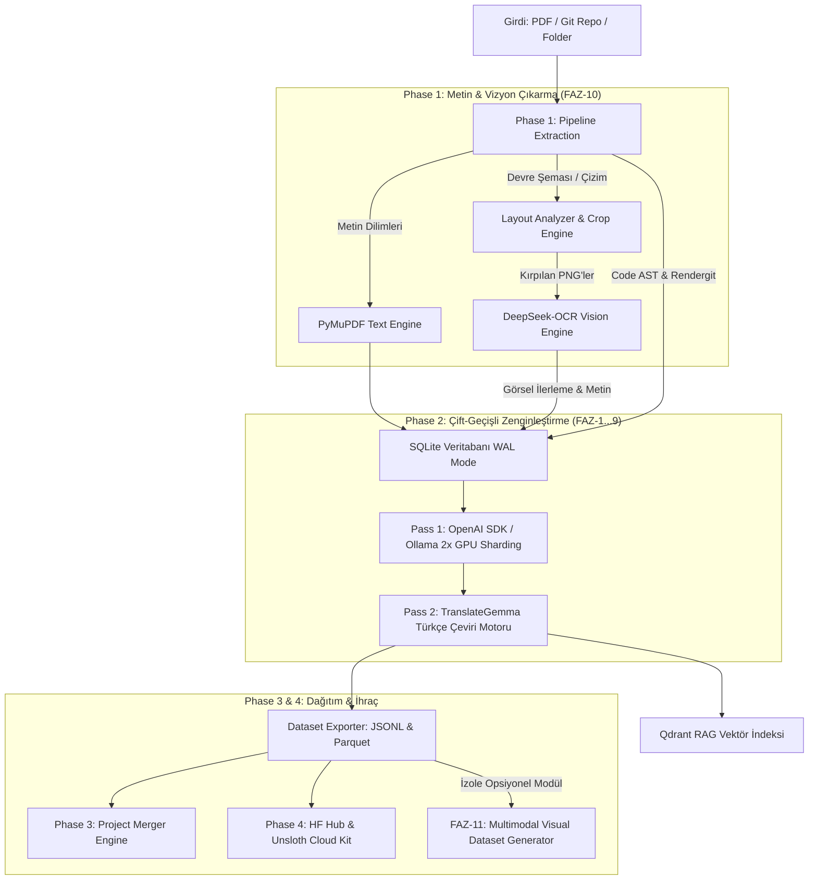

# ⚡ Elektor Universal Pipeline Mimari & Sistem Kılavuzu

Bu klasör (`.antigravity/`), Elektor Sentetik Veri & RAG Platformu projesinin sistem mimarisini, veri akışını, güvenlik denetimlerini ve modüler faz yapısını tanımlayan resmi teknik referans dokümanıdır.

---

## 🏗️ 1. Boru Hattı Mimarısı (Pipeline Architecture)

Sistem 4 ana aşamadan (Phase 1-4) ve izole vizyon/kod modüllerinden oluşur. PDF dökümanlarını, teknik şemaları ve Git kaynak kod depolarını yüksek kaliteli LLM fine-tuning veri setlerine (SFT, DPO, Multi-turn Chat, Code SFT, Visual Instruction Tuning) dönüştürür.



---

## 🛠️ 2. Temel Modüller & Sorumluluklar

| Dosya / Dizin | Sorumluluk |
| :--- | :--- |
| **`api_server.py`** | FastAPI tabanlı backend sunucusu. Proje yönetimi, pipeline tetikleme, RAG sorgulama, RLHF puanlama uç noktaları (`/api/dataset/rate`), proje birleştirme ve HF/Cloud endpoints. |
| **`run.py`** | Birleşik CLI arayüzü. `extract`, `enrich`, `embed`, `export`, `merge`, `api` ve 2x GPU Sharding desteği. |
| **`pipeline/extractor.py`** | PDF döküman ayrıştırma, sayfa dilimleme, DeepSeek-OCR çağrı yönetimi ve SQLite metadata indeksleme. |
| **`pipeline/layout_analyzer.py`** | FAZ-10 Akıllı Düzen Filtreleme (Smart Layout Analysis). PDF sayfalarındaki devre şeması, grafik ve çizimleri tespit edip `downloads/extracted_images/` klasörüne kırpar. |
| **`pipeline/vision_ocr.py`** | DeepSeek-OCR (`deepseek-ocr:3b-bf16`) vizyon sürücüsü. Bounding box ve görsel grounding metni üretir. |
| **`pipeline/code_extractor.py`** | `rendergit` mimarisi ile Git depolarını düzleştirme ve AST (Abstract Syntax Tree) kod birimlerini ayıklama. |
| **`pipeline/analyzer.py`** | OpenAI SDK uyumlu LLM zenginleştirme motoru. 4 sentetik kod kategorisi (`explanation`, `completion`, `bug_fix`, `unit_test`) üretimi. |
| **`pipeline/vector_store.py`** | Qdrant RAG vektör indeksleme (qdrant-client `query_points` uyumlu). |
| **`pipeline/dataset_builder.py`** | JSONL ve Parquet formatında SFT, DPO, Chat ve Code SFT veri seti ihracı. |
| **`pipeline/project_merger.py`** | Faz 3 Güvenli Proje ve Veri Seti Birleştirme Motoru (Dry-Run Audit + Atomic SQLite/JSONL Merge). |
| **`pipeline/hf_deployer.py`** | Faz 4 Hugging Face Hub otomatik yükleyici ve denetleyicisi. |
| **`pipeline/cloud_gpu_offloader.py`** | Faz 4 JupyterLab (`http://192.168.1.14:8888/lab`) ve Unsloth/Axolotl bulut GPU paket üreticisi (`.ipynb`, `.py`, `.sh`). |
| **`frontend/`** | React + Vite + Vanilla CSS web arayüzü (`MathMarkdownRenderer.tsx` KaTeX matematik, KaTeX On/Off raw mode toggle, RLHF puanlama butonları). |

---

## 🔒 3. Hugging Face & Bulut Aktarım Gizlilik Garantisi (Privacy & Security Policy)

> [!IMPORTANT]
> **Gizlilik Garantisi:** Sisteminizdeki hiçbir yerel ham veritabanı, log dosyası veya ham görsel dosya **kullanıcının açık onayı ve 2 aşamalı doğrulama süreci olmaksızın asla Hugging Face Hub'a gönderilmez.**

- **İzole Yerel Veriler (Asla Dışarı Sızmaz):**
  - Proje veritabanları (`database/*.db`)
  - Ham PDF görselleri (`downloads/extracted_images/`)
  - Log dosyaları (`exports/<project_id>/errors_and_warnings.log`)
  - Geçici çalışma dosyaları (`scratch/`, `.venv/`)
- **Filtrelenmiş İhraç Politikası:** `pipeline/hf_deployer.py` yükleme motoru, yalnızca `exports/<project_id>/` altındaki onaylanmış son kullanım `.jsonl` ve `.parquet` dosyalarını kapsar.
- **Kullanıcı Onayı & Token Denetimi:** HF aktarımı ancak kullanıcının arayüzden veya CLI üzerinden geçerli bir `HF_TOKEN` girmesi ve "Dağıtımı Başlat" butonuna tıklaması ile gerçekleşir.

---

## 📊 4. Veri Seti Yapısı (`exports/<project_id>/`)

- `code_sft_dataset.jsonl` / `.parquet`: İngilizce sentetik kod fine-tuning çiftleri.
- `tr_code_sft_dataset.jsonl` / `.parquet`: Türkçe sentetik kod fine-tuning çiftleri.
- `sft_dataset.jsonl` / `.parquet`: İngilizce teknik SFT Soru-Yanıt veri seti.
- `tr_sft_dataset.jsonl` / `.parquet`: Türkçe teknik SFT Soru-Yanıt veri seti.
- `dpo_dataset.jsonl` / `.parquet`: İngilizce DPO tercih çiftleri (`prompt`, `chosen`, `rejected`).
- `tr_dpo_dataset.jsonl` / `.parquet`: Türkçe DPO tercih çiftleri.
- `chat_dataset.jsonl` / `.parquet`: İngilizce çok turlu teknik diyaloglar (`messages`).
- `tr_chat_dataset.jsonl` / `.parquet`: Türkçe çok turlu teknik diyaloglar.
- `multimodal_visual_dataset.jsonl`: **[FAZ-11]** İzole LLaVA / Qwen-VL formatında görsel ince-ayar veri seti.
- `cloud_payload/`: JupyterLab `.ipynb` notebook ve Unsloth fine-tuning betikleri.
- `errors_and_warnings.log`: Projeye özel izole `WARNING` ve `ERROR` günlük dosyası (Faz 5).

---

## ⚡ 5. Unsloth & Cloud GPU Standartları

- **Taban Model**: `Qwen/Qwen3.5-2B` (BF16 LoRA & GGUF export) veya `unsloth/Qwen2.5-Coder-7B-Instruct`.
- **Hız Optimizasyonu**: `lora_dropout = 0`, `target_modules=["q_proj", "k_proj", "v_proj", "o_proj", "gate_proj", "up_proj", "down_proj"]`.
- **Güvenlik**: `remove_columns=dataset.column_names`, `dataset_num_proc=1`, `packing=False`.

---

## 🔮 6. Gelecek Yol Haritası & Faz Planları

### 📌 FAZ 8: Chat Arenası Tam Markdown & LaTeX Matematik Desteği + RLHF İnsan Onay Katmanı - [TAMAMLANDI]
- **KaTeX Matematik & Matris Rendering (`MathMarkdownRenderer.tsx`)**: Chat Arenası (`SectionModelChat.tsx`) ve Veri Seti İnceleyicide (`SectionDatasetViewer.tsx`) karmaşık LaTeX denklemleri (`$e=mc^2$`, `$$\int ...$$`), matrisler (`\begin{matrix}`) ve HTML Markdown tablolarının KaTeX ile canlı görselleştirilmesi sağlandı.
- **Render Aç/Kapa Anahtarı (Raw Text Debugging)**: Arayüze `👁️ KaTeX Render (Açık/Kapalı)` toggle anahtarı eklenerek hata analizi sırasında ham metnin doğrudan görüntülenebilmesi sağlandı.
- **Tahribatsız İnsan Onay & Kalite Katmanı (RLHF / DPO Alignment)**: Ham veritabanı yapısını bozmadan `enrichments` tablosuna `human_rating` (+1 / -1), `is_excluded` (1 / 0) ve `human_feedback` alanları eklendi. `POST /api/dataset/rate` ve `POST /api/dataset/exclude` uç noktaları ile kullanıcının beğendiği/beğenmediği veya sildiği kayıtlar işaretlenir; veri seti ihraç motorları (`dataset_builder.py`) silinen kayıtları dışa aktarımdan otomatik süzer.

### 📌 FAZ 9: OpenAI-Uyumlu API Standardına Geçiş & Sunucu Performans / Hata Ayıklama Oturumu - [TAMAMLANDI]
- **Evrensel OpenAI SDK Standardı (`v1/chat/completions`)**: Özel ham `ollama` Python istemcisi yerine sektör standardı `openai` SDK (`from openai import OpenAI / AsyncOpenAI`) ve `base_url` mimarisine geçiş.
- **Sunucu & Donanım Bağımsızlığı**: Tek bir istemci mimarisi ile yerel Ollama (`http://192.168.1.14:11434/v1`), vLLM, SGLang, LM Studio, DeepSeek, Groq, OpenRouter ve Hugging Face Inference API uç noktalarına sıfır kod değişikliği ile tak-çalıştır erişim.

### 📌 FAZ 10: Multimodal Tarama & Çizim / Grafik Anlamlandırma Motoru (DeepSeek-OCR / DeepSeek-OCR2) - [TAMAMLANDI & GELİŞTİRİLİYOR]
- **DeepSeek-OCR Mimarisi (`deepseek-ocr:3b-bf16`)**: PDF'lerde yer alan devre şemaları, pinout diyagramları, grafikler ve basılı şemalar `VisionOCRManager` üzerinden otomatik anlamlandırılır.
- **DeepSeek-OCR vs DeepSeek-OCR2 Yetenek Analizi**:
  - **Grounding İstem Yapısı**: İstem dili `<image>\n<|grounding|>` formatına uyarlanmıştır.
  - **Bounding Box Tespiti**: Görsel elemanların koordinatlarını (`[ymin, xmin, ymax, xmax]`) tespit ederek sayfa metni içerisine bağlamsal etiket olarak yerleştirir.
  - **DeepSeek-OCR2 Vizyon Hedefi**: Şema içi metinlerin okunaklılığı, küçük sembollerin (direnç, kapasitör, entegre ayakları) ve karmaşık grafik eksenlerinin daha yüksek çözünürlüklü işlenmesi için DeepSeek-OCR2/VLM model güncellemesi değerlendirilmektedir.
- **Otomatik VRAM Offload & 2x GPU Sharding**: Vizyon OCR adımı biter bitmez `unload_ollama_model` çağrılarak VRAM boşaltılır. 2x 16GB GPU donanımı (Port 11434 & 11435) üzerinde SQLite WAL modunda (`PRAGMA journal_mode=WAL;`) çakışmasız paralel zenginleştirme sağlanmıştır.

---

### 📌 FAZ 11: Otomatik Multimodal Görsel İnce-Ayar Veri Seti Motoru (Visual Instruction Tuning / LLaVA Format) - [RESMİ UYGULAMA PLANI]

> [!TIP]
> **Mimari İlke:** FAZ-11 geliştirmesi **tamamen izole bir opsiyonel modül** olarak tasarlanacak; ana metin sentezleme ve RAG boru hattı akışını kesinlikle bozmayacak veya yavaşlatmayacaktır.

#### 1. İzolasyon & Modüler Boru Hattı Akışı
- FAZ-11, ana boru hattından bağımsız bir alt komut (`python run.py export_visual_dataset`) veya isteğe bağlı bir bayrak (`--enable-visual-dataset`) olarak çalışacaktır.
- Metin çıkarma ve Q&A sentezleme adımları görsel etiketleme beklemeden doğrudan tamamlanacaktır.

#### 2. Donanım & Saklama Alanı Optimizasyonu (Resource & Storage Management)
- **Akıllı Görsel Sıkıştırma (WebP / JPEG 85% Quality)**: `downloads/extracted_images/` altındaki ham PNG dosyaları (5MB+), boyut sınırlandırması (maksimum 1024px genişlik) ve WebP formatı ile 100KB - 300KB seviyesine sıkıştırılarak saklama alanı ihtiyacı %90 oranında azaltılacaktır.
- **Kota & Otomatik Temizlik Politikası**: Proje bazlı maksimum görsel saklama kotası (örneğin 5 GB) tanımlanacak; ihraç tamamlandıktan sonra ham kırpılmış geçici görseller opsiyonel olarak temizlenebilecektir.
- **Bellek ve VRAM İzolasyonu**: Görsel etiketleme işlemi toplu (batch) olarak yürütülecek ve her 50 görselde bir VRAM önbelleği temizlenerek bellek sızıntıları önlenecektir.

#### 3. LLaVA / Qwen2-VL Uyumlu Veri Şeması
Üretilen görsel veri seti `exports/<project_id>/multimodal_visual_dataset.jsonl` dosyasına şu standartta ihraç edilecektir:

```json
{
  "id": "vis_sample_bwt901_p2_draw_0",
  "image": "images/bwt901_p2_draw_0.webp",
  "conversations": [
    {
      "from": "human",
      "value": "<image>\nBu teknik çizimdeki devre mimarisini ve pin bağlantılarını açıkla."
    },
    {
      "from": "gpt",
      "value": "Görselde BWT901 ivmeölçer modülünün RX/TX seri haberleşme pin dizilimi ve 3.3V güç besleme devresi görülmektedir..."
    }
  ],
  "metadata": {
    "source_pdf": "BWT901_Datasheet.pdf",
    "page_number": 2,
    "bounding_box": [120, 45, 600, 350],
    "model_vision": "deepseek-ocr:3b-bf16"
  }
}
```

---

## 📊 7. Ollama Cloud & Vizyon Model Benchmark Referansı

### Metin & Sentezleme Modelleri
| Model | Prompt Tokens | Gen Tokens | Eval Speed (t/s) | Wall Time (s) | Durum |
|---|---|---|---|---|---|
| `nemotron-3-nano:30b` | 28 | 129 | **130.03** | 0.99s | ✅ |
| `gpt-oss:20b` | 77 | 131 | **57.78** | 2.27s | ✅ |
| `gpt-oss:120b` | 77 | 102 | **54.34** | 1.88s | ✅ |
| `minimax-m3` | 186 | 51 | **42.93** | 1.19s | ✅ |
| `gemma4:31b` | 23 | 20 | **18.15** | 1.10s | ✅ |
| `nemotron-3-super` | 28 | 113 | **6.65** | 16.99s | ✅ |

### Multimodal Vizyon & Görsel OCR Modelleri (FAZ-10 & FAZ-11)
| Model | Özel İstem Standardı | Kullanım Alanı | VRAM/Boyut | Durum |
|---|---|---|---|---|
| `deepseek-ocr:3b-bf16` | `<image>\nParse the figure.` / `<|grounding|>` | Şema/Devre Analizi & Tam Sayfa Markdown OCR | ~3.8 GB | ✅ **Varsayılan** |
| `qwen2.5-vl:7b` | `<image>\nDescribe this image in detail.` | Genel Multimodal Görsel QA & Anlamsal Çıkarım | ~5.2 GB | ✅ Destekleniyor |
| `llava-phi3:3.8b` | `<image>\nAnalyze image.` | Hafif Görsel İnce-Ayar Etiketleme | ~2.9 GB | ✅ Destekleniyor |
| `minicpm-v:8b` | `<image>\nParse chart/table.` | Yüksek Çözünürlüklü Grafik & Tablo Okuma | ~6.1 GB | ✅ Destekleniyor |
