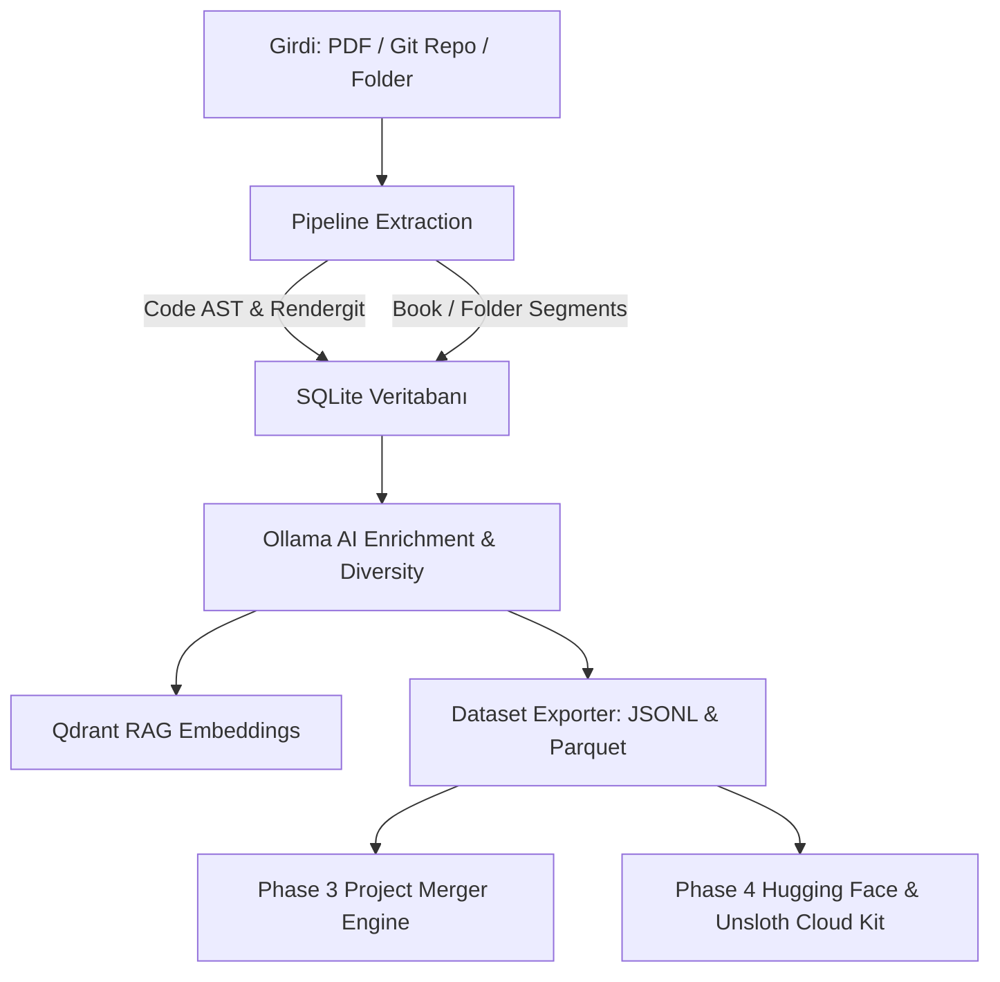

# ⚡ Elektor Universal Pipeline Mimari & Sistem Kılavuzu

Bu klasör (`.antigravity/`), Elektor Sentetik Veri & RAG Platformu projesinin sistem mimarisini, veri akışını ve modüler yapısını tanımlayan güncel teknik referans dokümanını içerir.

---

## 🏗️ 1. Boru Hattı Mimarısı (Pipeline Architecture)

Sistem 4 ana aşamadan (Phase 1-4) oluşur ve PDF dökümanları ile Git kaynak kod depolarını yüksek kaliteli LLM fine-tuning veri setlerine (SFT, DPO, Multi-turn Chat, Code SFT) dönüştürür.

---

## 🛠️ 2. Temel Modüller & Sorumluluklar

| Dosya / Dizin | Sorumluluk |
| :--- | :--- |
| **`api_server.py`** | FastAPI tabanlı backend sunucusu. Proje yönetimi, pipeline tetikleme, RAG sorgulama, proje birleştirme ve HF/Cloud endpoints. |
| **`run.py`** | Birleşik komut satırı arayüzü (CLI). `extract`, `enrich`, `embed`, `export`, `merge` ve `server` komutları. |
| **`pipeline/extractor.py`** | PDF döküman ayrıştırma, sayfa dilimleme ve SQLite metadata indeksleme. |
| **`pipeline/code_extractor.py`** | `rendergit` mimarisi ile Git depolarını düzleştirme ve AST (Abstract Syntax Tree) kod birimlerini ayıklama. |
| **`pipeline/analyzer.py`** | Ollama LLM zenginleştirme motoru. 4 sentetik kod kategorisi (`explanation`, `completion`, `bug_fix`, `unit_test`) üretimi. |
| **`pipeline/vector_store.py`** | Kelime sınırı korumalı chunking ve Qdrant RAG vektör indeksleme. |
| **`pipeline/dataset_builder.py`** | JSONL ve Parquet formatında SFT, DPO, Chat ve Code SFT veri seti ihracı. |
| **`pipeline/project_merger.py`** | Faz 3 Güvenli Proje ve Veri Seti Birleştirme Motoru (Dry-Run Audit + Atomic SQLite/JSONL Merge). |
| **`pipeline/hf_deployer.py`** | Faz 4 Hugging Face Hub otomatik yükleyici ve denetleyicisi. |
| **`pipeline/cloud_gpu_offloader.py`** | Faz 4 JupyterLab (`http://192.168.1.14:8888/lab`) ve Unsloth/Axolotl bulut GPU paket üreticisi (`.ipynb`, `.py`, `.sh`). |
| **`frontend/`** | React + Vite + Vanilla CSS web arayüzü (Bölüm A, B, C, Proje Gezgini, HF & Bulut GPU Modalı, Yardım Modalı). |

---

## 📊 3. Veri Seti Yapısı (`exports/<project_id>/`)

- `code_sft_dataset.jsonl` / `.parquet`: İngilizce sentetik kod fine-tuning çiftleri.
- `tr_code_sft_dataset.jsonl` / `.parquet`: Türkçe sentetik kod fine-tuning çiftleri.
- `sft_dataset.jsonl` / `.parquet`: İngilizce teknik SFT Soru-Yanıt veri seti.
- `tr_sft_dataset.jsonl` / `.parquet`: Türkçe teknik SFT Soru-Yanıt veri seti.
- `dpo_dataset.jsonl` / `.parquet`: İngilizce DPO tercih çiftleri (`prompt`, `chosen`, `rejected`).
- `tr_dpo_dataset.jsonl` / `.parquet`: Türkçe DPO tercih çiftleri.
- `chat_dataset.jsonl` / `.parquet`: İngilizce çok turlu teknik diyaloglar (`messages`).
- `tr_chat_dataset.jsonl` / `.parquet`: Türkçe çok turlu teknik diyaloglar.
- `cloud_payload/`: JupyterLab `.ipynb` notebook ve Unsloth fine-tuning betikleri.
- `errors_and_warnings.log`: Projeye özel izole `WARNING` ve `ERROR` günlük dosyası (Faz 5).

---

## ⚡ 4. Unsloth & Cloud GPU Standartları

- **Taban Model**: `Qwen/Qwen3.5-2B` (BF16 LoRA & GGUF export) veya `unsloth/Qwen2.5-Coder-7B-Instruct`.
- **Hız Optimizasyonu**: `lora_dropout = 0`, `target_modules=["q_proj", "k_proj", "v_proj", "o_proj", "gate_proj", "up_proj", "down_proj"]`.
- **Güvenlik**: `remove_columns=dataset.column_names`, `dataset_num_proc=1`, `packing=False`.

---

## 🔮 5. Gelecek Yol Haritası (Roadmap & Planned Phases)

### 📌 FAZ 5: Proje Bazlı İzole Hata & Uyarı Günlük Sistemi (`pipeline/project_logger.py`) - [TAMAMLANDI]
- **Proje Dizin İzolasyonu**: Tüm iş akışı (verbose logs) yerine **sadece hata (`ERROR`) ve uyarı (`WARNING`)** seviyesindeki olayları her projenin kendi ihraç klasöründe (`exports/<project_id>/errors_and_warnings.log`) saklayan modüler günlükleme altyapısı.

### 📌 FAZ 6: Proje Gezgini Entegre System Prompt & Persona Editörü - [TAMAMLANDI]
- **Görsel Editör Arayüzü (`prompt.html`)**: `/Users/hakankilicaslan/taslak/prompt.html` şablonu "Proje Gezgini & Çoklu Veri Setleri" modalı içerisinden çağrılabilir interaktif bir **Developer System Prompt, Persona & Tool Schema Editörüne** dönüştürülmüştür.
- **Şablon Kütüphanesi & Persona Motoru (`system_prompts`)**: `/Users/hakankilicaslan/Git/system_prompts` reposundaki `persona_map.yaml` ve `prompts.json` yapısı backend uç noktası (`/api/personas`) ile bağlanarak hazır uzmanlık personoları (Octave Matematik, C++ Algoritma Uzmanı, Mekanik Mühendisi, SDR Uzmanı) seçilebilir ve proje bazlı düzenlenebilir hale getirilmiştir.

### 📌 FAZ 7: HF Serverless Inference & ZeroGPU Hibrit Fallback Motoru - [GELECEK VİZYONU]
- **Sıfır Donanım Maliyeti**: Yerel GPU sunucusu (`192.168.1.14:11434`) çevrimdışı veya yoğun olduğunda, sentezleme isteklerini otomatik olarak ücretsiz Hugging Face Serverless Inference API uç noktalarına (`Qwen/Qwen2.5-72B-Instruct`, `Llama-3.3-70B-Instruct`) veya HF Spaces ZeroGPU (A100/H100) ortamına yönlendirerek kesintisizsentetik veri üretimi sağlama.

### 📌 FAZ 8: Chat Arenası Tam Markdown & LaTeX Matematik Formül Desteği - [GELECEK VİZYONU (DÜŞÜK ÖNCELİK)]
- **Zengin İfadeler**: Mevcut hafif metin & kod renklendiricisi tam ve yeterli olmakla birlikte, ileride karmaşık LaTeX matris/denklem gösterimleri ve Markdown tabloları için tam rendering motoru entegrasyonu.
