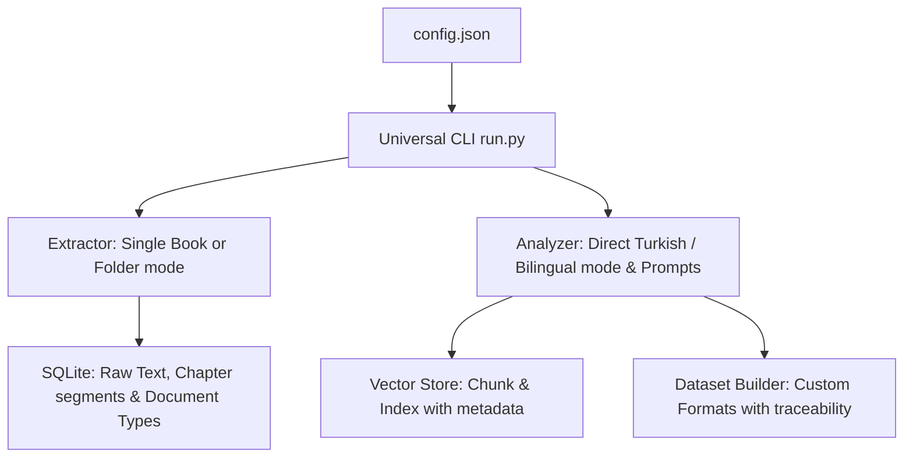

# Universal PDF Dataset & RAG Generator (Roadmap & Status)

This document outlines the roadmap, completed phases, and implementation status of transforming our domain-specific pipeline into a fully generalized **Universal PDF Dataset & RAG Generator**.

---

## 🗺️ Universal Pipeline Architecture

Decoupled PDF extraction, database schema, and LLM prompts from any specific magazine domain. All variables are dynamically configured via `config.json`.

---

## 🚀 Completed Phases (Tamamlanan Aşamalar)

### 📌 Phase 1: Expand Configuration (`config.json`) - [COMPLETED]
Redesigned configuration schema to support domain-agnostic variables:
- `input_mode`: `"folder"` (multiple PDFs) or `"book"` (single PDF split by bookmarks/page ranges).
- `input_path`: Path to the PDF folder or single PDF file.
- `llm_persona`: Subject matter expertise (e.g., *"You are a professional software-defined radio (SDR) engineer..."*).
- `llm_subject`: Core topic description used to frame SFT/DPO generation.
- `generation_language`: `"tr"`, `"en"`, or `"bilingual"`.
- `translation_target`: Target language code (e.g. `"tr"`).
- `sft_qa_count`: Number of Q&A pairs to generate per segment.
- `dataset_name` & `dataset_name_tr`: Custom metadata tags for English and Turkish SFT context prompts.
- `qdrant_collection_name`: Dynamic collection name for local indexing.

### 📌 Phase 2: Universal Extractor (`extractor.py`) - [COMPLETED]
Decoupled text parsing and segmentation:
- **Book Mode**: Splits a single large PDF book/datasheet into contiguous sections using PDF outline bookmarks (`pypdf` outline) with a fallback 10-page slice generator when outlines are missing.
- **Folder Mode**: Walk directory structure recursively to parse all PDFs, removing any hardcoded CSV dependencies.
- **OCR Normalizer**: Expanded `clean_ocr_text` to support language-independent and Turkish technical symbol corrections.

### 📌 Phase 3: Dynamic Domain Prompts (`analyzer.py`) - [COMPLETED]
Decoupled LLM prompts from "embedded systems engineering":
- Dynamic enjection of `llm_persona` and `llm_subject` directly into Qwen and TranslateGemma templates.
- Support for unbuffered real-time log output (`PYTHONUNBUFFERED=1`) to monitor remote Ollama loading progress.

### 📌 Phase 4: Flexible Dataset Formats (`dataset_builder.py`) - [COMPLETED]
Refactored training data format compiler:
- Restructured `exports/` folder: Now exports SFT, Chat, and DPO datasets to database-specific subfolders (e.g., `exports/sdr_engineers/`), eliminating branch merge conflicts.
- General metadata mapping using config-level `dataset_name` and `dataset_name_tr` variables, eliminating hardcoded "Elektor" strings from SFT instructions.

---

## 🔬 Pilot Run & Validation: SDR4Engineers.pdf
*   **Target PDF**: `/Users/hakankilicaslan/Documents/SDR4Engineers.pdf`
*   **Branch**: `feature/universal-pipeline`
*   **Extraction**: Generated **160 chapters/segments** from PDF outlines.
*   **AI Enrichment**: Processed using `qwen3.6:27b-mtp-q4_K_M` (analyzer) and `translategemma:12b-it-q4_K_M` (translator).
*   **Vector DB**: Embedded **1,278 chunks** in `qdrant_sdr/` using `nomic-embed-text:latest`.
*   **HF Upload**: Published successfully as a new Hugging Face dataset under [onkanat/sdr-engineers-dataset](https://huggingface.co/datasets/onkanat/sdr-engineers-dataset).
