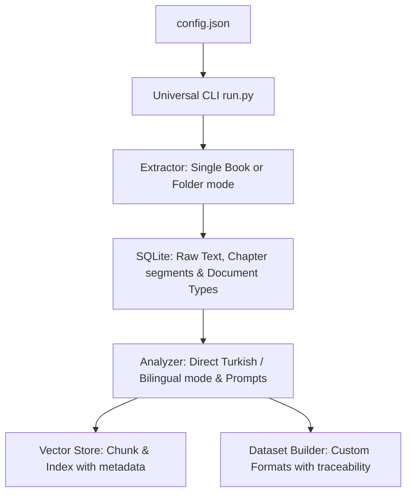

# Elektor Pipeline -> Universal PDF Dataset & RAG Generator (Roadmap)

This document outlines the roadmap and TODO list to transform our Elektor-specific processing pipeline into a domain-agnostic **Universal PDF Dataset & RAG Generator**. It incorporates the analysis of the existing Elektor pipeline and details the necessary architectural upgrades, file-level modifications, hardware strategies, and pilot runs.

---

## 🗺️ Universal Pipeline Architecture

To make the pipeline work on **any** PDF book or folder of PDFs, we decouple the PDF extraction, database schema, and LLM prompts from the Elektor magazine domain. The behavior is fully controlled by an expanded `config.json` file.



---

## 🚀 Core Architectural Upgrades (Kritik Mimari Değişiklikler)

### 1. Chapter/Segment-Based Chunking (Bölüm Tabanlı Parçalama)
Instead of truncating document text at 4,000 characters (which loses critical details from datasheets and reference manuals), the universal pipeline will split documents by sections or 800-2,000 token context chunks.
- **Unit of Analysis**: Document section/chunk instead of whole document.
- **Traceability**: Each SFT/DPO record stores metadata indicating its `source_file`, `source_pages`, `chapter`, and `section`.

### 2. Direct Turkish Generation (Doğrudan Türkçe Üretim)
To avoid SFT/DPO structural translation distortion, the pipeline will support generating Turkish training records directly from English/Turkish source contexts, keeping English generation optional.

### 3. Verification & Safety Layer for DPO (DPO Doğrulama Katmanı)
Implement an automated LLM validation step for DPO pairs to ensure:
- The `chosen` answer is technically supported by the context.
- The `rejected` answer represents a realistic hardware mistake (e.g. wrong GPIO voltage, missing pull-ups, swapping TX/RX, ignoring decoupling capacitors).
- The error is critical from a safety perspective.

### 4. General Document Schema (Genel Belge Şeması)
Rename the `articles` database table to `documents` to support various source document types:
- `datasheet`, `reference_manual`, `application_note`, `user_guide`, `technical_book`, `laboratory_manual`, `schematic`, `pinout`, `technical_drawing`.

---

## 📋 TODO & Roadmap

### Phase 1: Expand Configuration (`config.json`)
Redesign the configuration schema to support domain-agnostic variables:
- `input_mode`: `"folder"` (multiple PDFs) or `"book"` (single PDF split by bookmarks/page ranges).
- `input_path`: Path to the PDF folder or single PDF file.
- `llm_persona`: Subject matter expertise (e.g., *"You are an expert in embedded systems engineering"*).
- `llm_subject`: Core topic description used to frame SFT/DPO generation.
- `generation_language`: `"tr"`, `"en"`, or `"bilingual"`.
- `translation_target`: Target language code (optional, e.g., `"tr"`).
- `sft_qa_count`: Number of Q&A pairs to generate per segment (default: 3 to 10).

### Phase 2: Universal Extractor (`extractor.py` Refactoring)
- **Single Book Mode**: Split large PDFs into chapters/sections using PDF bookmarks (`pypdf` outline) or page-interval tables.
- **Folder Mode**: Parse document metadata or filename directly, removing `zoom_pageinfo.csv` dependency.
- **OCR Normalizer**: Expand `clean_ocr_text` to support language-independent and Turkish technical symbol corrections (e.g., `I/1/l`, `O/0`, `µ/u`, `Ω/Q`, `3.3 V`, `10 kΩ`).

### Phase 3: Dynamic Domain Prompts (`analyzer.py` Refactoring)
- Decouple LLM prompts from "embedded systems engineering".
- Use string formatting to inject `llm_persona` and `llm_subject` from `config.json` directly into Qwen and TranslateGemma prompts.
- Implement segment-based prompting and direct Turkish SFT/DPO/chat generation.

### Phase 4: Flexible Dataset Formats (`dataset_builder.py` Refactoring)
- Support multiple training data formats:
  - **Alpaca Format**: `{"instruction": "...", "input": "...", "output": "..."}`.
  - **ShareGPT / ChatML Format**: `{"messages": [{"role": "user", "content": "..."}, {"role": "assistant", "content": "..."}]}`.
- Preserve source metadata (`source_file`, `source_pages`, `difficulty`, `quality_score`) directly in the exported JSONL files.

---

## 🛠️ Code Corrections & Quality Assurance

Prior to launching the universal pipeline, we will verify and correct formatting, indentation, and package import structures in:
- `extractor.py`, `analyzer.py`, `vector_store.py`, `dataset_builder.py`, `run.py`.

We will run compilation tests:
```bash
python3.11 -m py_compile extractor.py analyzer.py vector_store.py dataset_builder.py run.py run_production.py
```

---

## ⚙️ Proposed Universal `config.json` Schema

```json
{
  "input_mode": "folder",
  "input_path": "/Users/hakankilicaslan/Git/pico_documentation",
  "db_path": "universal_dataset.db",
  "qdrant_db_path": "qdrant_universal_db",
  "ollama_url": "http://192.168.1.14:11434",
  
  "model_embedding": "nomic-embed-text:latest",
  "model_analyzer": "qwen3.6:35b-a3b-mtp-q4_K_M",
  "model_translator": "translategemma:12b-it-q4_K_M",
  
  "llm_persona": "You are a professional embedded systems engineer and senior hardware instructor specializing in Raspberry Pi Pico (RP2040/RP2350).",
  "llm_subject": "RP2040 and RP2350 hardware architecture, GPIO configuration, PIO, DMA, I2C, SPI, and MicroPython/C SDK development.",
  "generation_language": "tr",
  "translation_target": null,
  "sft_qa_count": 5,
  
  "chunk_size": 1000,
  "chunk_overlap": 200,
  "ocr_threshold_chars": 100,
  "tesseract_cmd": "/opt/homebrew/bin/tesseract"
}
```

---

## 🖥️ Hardware Strategy & Pilot Run

### Hardware Strategy (2x RTX 4060 Ti 16 GB)
- **OCR/Extraction**: CPU-bound task, run as a separate phase before LLM execution.
- **Sequential Ingestion**: Load the embedding model, build Qdrant indexes, and unload it before loading the analyzer model (Qwen 35B) to optimize VRAM space.
- **Keep Alive**: Maintain model unloading (`keep_alive=0`) at the end of each batch run to prevent memory leaks.

### Pilot PDF Group (First Ingestion Group)
To test and validate extraction quality, Turkish technical terminology, and DPO safety accuracy:
1. `getting-started-with-pico.pdf`
2. `rp2040-datasheet.pdf`
3. `raspberry-pi-pico-c-sdk.pdf`
4. `connecting-to-the-internet-with-pico-w.pdf`
5. `hardware-design-with-rp2040.pdf`
6. `Pico-R3-A4-Pinout.pdf`
7. `PicoW-A4-Pinout.pdf`
