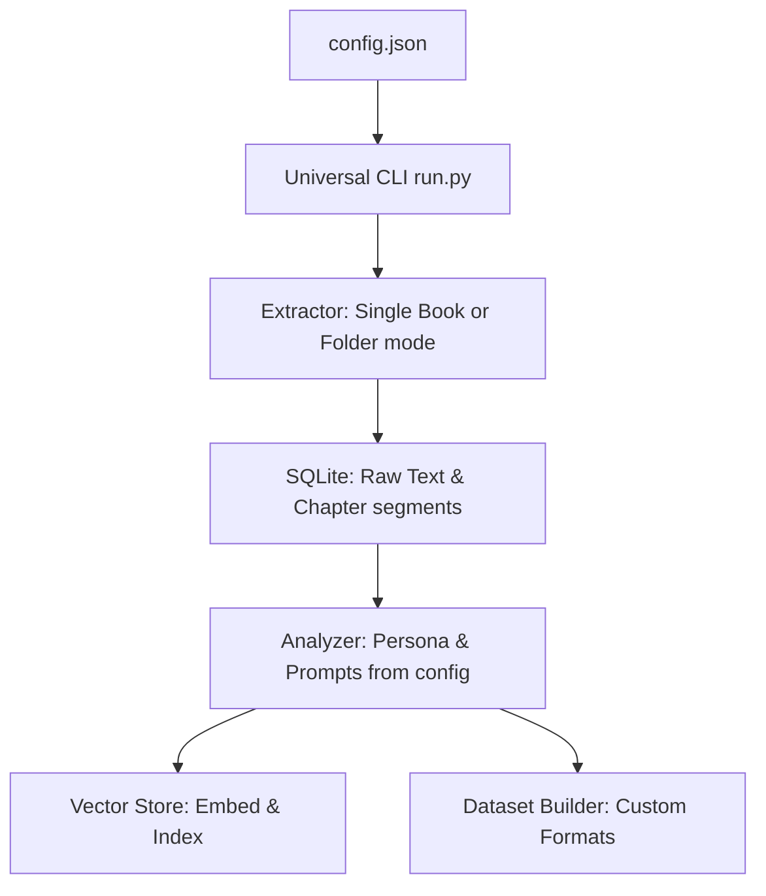

# Elektor Pipeline -> Universal PDF Dataset Generator (Roadmap)

This document outlines the roadmap and TODO list to transform our Elektor-specific processing pipeline into a **Universal PDF Dataset & RAG Generator** in the next session.

---

## 🗺️ Universal Pipeline Architecture

To make the pipeline work on **any** PDF book or folder of PDFs, we will decouple the PDF extraction and LLM prompts from the Elektor magazine domain. The behavior will be fully controlled by an expanded `config.json` configuration file.



---

## 📋 TODO & Roadmap for the Next Session

### Phase 1: Expand & Document `config.json`
We will redesign the configuration schema to support domain-agnostic variables:
- `input_mode`: `"folder"` (multiple PDFs) or `"book"` (single PDF split by bookmarks/page ranges).
- `input_path`: Path to the PDF folder or single PDF file.
- `metadata_mode`: `"filename"`, `"pdf_metadata"`, `"llm_generated"`, or `"csv"`.
- `llm_persona`: Subject matter expertise (e.g., *"You are an expert in chemical engineering"*).
- `llm_subject`: Core topic description used to frame SFT/DPO generation.
- `translation_target`: Target language code (e.g., `"tr"`, `"es"`, or `null` to disable translation).
- `sft_qa_count`: Number of Q&A pairs to generate per segment (default: 3).

### Phase 2: Universal Extractor (`extractor.py` Refactoring)
- **Single Book Mode**: Implement auto-splitting of a single large PDF into chapters/sections using PDF bookmarks (`pypdf` outline) or page-interval tables.
- **Folder Mode**: Automatically parse article titles using PDF metadata or filename, eliminating the dependency on `zoom_pageinfo.csv`.
- **Text Cleaners**: Expand `clean_ocr_text` to support language-independent sanitization.

### Phase 3: Dynamic Domain Prompts (`analyzer.py` Refactoring)
- Decouple LLM prompts from "embedded systems engineering".
- Use string formatting to inject `llm_persona` and `llm_subject` from `config.json` directly into Qwen and TranslateGemma prompts.
- Make the Turkish translation target fully optional (skipped if `translation_target` is `null`).

### Phase 4: Flexible Dataset Formats (`dataset_builder.py` Refactoring)
- Support multiple training data formats:
  - **Alpaca Format**: `{"instruction": "...", "input": "...", "output": "..."}`.
  - **ShareGPT / ChatML Format**: `{"messages": [{"role": "user", "content": "..."}, {"role": "assistant", "content": "..."}]}`.

---

## ⚙️ Proposed Universal `config.json` Schema

Below is the draft structure for the next session's configuration file:

```json
{
  "input_mode": "book",
  "input_path": "/path/to/my_python_programming_book.pdf",
  "db_path": "python_book_dataset.db",
  "qdrant_db_path": "qdrant_python_db",
  "ollama_url": "http://192.168.1.14:11434",
  
  "model_embedding": "nomic-embed-text:latest",
  "model_analyzer": "qwen3.6:35b-a3b-mtp-q4_K_M",
  "model_translator": "translategemma:12b-it-q4_K_M",
  
  "llm_persona": "You are a professional Python software architect and senior AI instructor.",
  "llm_subject": "Python programming best practices, data structures, and object-oriented design",
  "translation_target": "tr",
  "sft_qa_count": 3,
  
  "chunk_size": 800,
  "chunk_overlap": 150,
  "ocr_threshold_chars": 100,
  "tesseract_cmd": "/usr/local/bin/tesseract"
}
```
