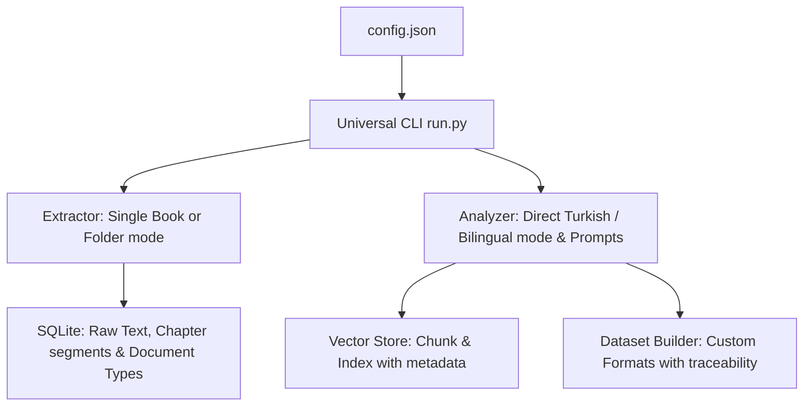

# Universal PDF Dataset & RAG Generator (Roadmap & Status)

This document outlines the roadmap, completed phases, and implementation status of transforming our domain-specific pipeline into a fully generalized **Universal PDF Dataset & RAG Generator**.

---

## 🗺️ Universal Pipeline Architecture

Decoupled PDF extraction, database schema, and LLM prompts from any specific magazine domain. All variables are dynamically configured via `config.json`.

---

## 🚀 Completed Phases (Tamamlanan Aşamalar)

### 📌 Phase 1: Expand Configuration (`config.json`) - [COMPLETED]
Redesigned configuration schema to support domain-agnostic variables:
- `input_mode`: `"folder"` (multiple PDFs) or `"book"` (single PDF split by bookmarks/page ranges).
- `input_path`: Path to the PDF folder or single PDF file.
- `llm_persona`: Subject matter expertise (e.g., *"You are a professional software-defined radio (SDR) engineer..."*).
- `llm_subject`: Core topic description used to frame SFT/DPO generation.
- `generation_language`: `"tr"`, `"en"`, or `"bilingual"`.
- `translation_target`: Target language code (e.g. `"tr"`).
- `sft_qa_count`: Number of Q&A pairs to generate per segment.
- `dataset_name` & `dataset_name_tr`: Custom metadata tags for English and Turkish SFT context prompts.
- `qdrant_collection_name`: Dynamic collection name for local indexing.

### 📌 Phase 2: Universal Extractor (`extractor.py`) - [COMPLETED]
Decoupled text parsing and segmentation:
- **Book Mode**: Splits a single large PDF book/datasheet into contiguous sections using PDF outline bookmarks (`pypdf` outline) with a fallback 10-page slice generator when outlines are missing.
- **Folder Mode**: Walk directory structure recursively to parse all PDFs, removing any hardcoded CSV dependencies.
- **OCR Normalizer**: Expanded `clean_ocr_text` to support language-independent and Turkish technical symbol corrections.

### 📌 Phase 3: Dynamic Domain Prompts (`analyzer.py`) - [COMPLETED]
Decoupled LLM prompts from "embedded systems engineering":
- Dynamic enjection of `llm_persona` and `llm_subject` directly into Qwen and TranslateGemma templates.
- Support for unbuffered real-time log output (`PYTHONUNBUFFERED=1`) to monitor remote Ollama loading progress.

### 📌 Phase 4: Flexible Dataset Formats (`dataset_builder.py`) - [COMPLETED]
Refactored training data format compiler:
- Restructured `exports/` folder: Now exports SFT, Chat, and DPO datasets to database-specific subfolders (e.g., `exports/sdr_engineers/`), eliminating branch merge conflicts.
- General metadata mapping using config-level `dataset_name` and `dataset_name_tr` variables, eliminating hardcoded "Elektor" strings from SFT instructions.

---

## 🔬 Pilot Run & Validation: SDR4Engineers.pdf
*   **Target PDF**: `/Users/hakankilicaslan/Documents/SDR4Engineers.pdf`
*   **Branch**: `feature/universal-pipeline`
*   **Extraction**: Generated **160 chapters/segments** from PDF outlines.
*   **AI Enrichment**: Processed using `qwen3.6:27b-mtp-q4_K_M` (analyzer) and `translategemma:12b-it-q4_K_M` (translator).
*   **Vector DB**: Embedded **1,278 chunks** in `qdrant_sdr/` using `nomic-embed-text:latest`.
*   **HF Upload**: Published successfully as a new Hugging Face dataset under [onkanat/sdr-engineers-dataset](https://huggingface.co/datasets/onkanat/sdr-engineers-dataset).

---

## 🔮 Future Plans & Cloud Expansion (Gelecek Planlar)

### 📌 Phase 5: Automatic One-Click Hugging Face Push (`run.py export --push-to-hub`)
- **Arayüz & CLI Entegrasyonu**: Bölüm B arayüzüne ve `run.py export` komutuna tek tıkla Hugging Face Hub'a yükleme seçeneği (`--push-to-hub`).
- **Otomatik Dataset Card & Kapak Üretimi**: Dökümanın ilk sayfasını / kapağını otomatik görsel yaparak YAML meta-veri başlığı ile Hugging Face `README.md` kartını otomatik derleme.

### 📌 Phase 6: Zero-Cost Cloud GPU & Serverless Offloading (Ücretsiz Donanım Stratejisi)
- **Hugging Face Serverless Inference API**: Yerel GPU yetersizliğinde istekleri ücretsiz HF Serverless API uç noktalarına (`Qwen/Qwen2.5-72B-Instruct`, `Llama-3.3-70B-Instruct`) yönlendirerek yerel donanım yükünü sıfırlama.
- **HF Spaces + ZeroGPU (NVIDIA A100/H100)**: Sentetik veri üretim script'lerini ücretsiz ZeroGPU destekli HF Space üzerinde çalıştırma.
- **Colab & Kaggle Notebook Entegrasyonu**: Haftalık 30 saat ücretsiz 2x T4 GPU (Kaggle) ve Colab ortamında toplu üretim yapıp verileri anında `dataset.push_to_hub()` ile HF Hub'a aktarma.

---

### 📌 Phase 7: Git Repository Rendergit & AST Code Dataset Generator - [COMPLETED & EXPANDING]
- **Rendergit Flattening**: Karpathy'nin `rendergit` mimarisini saf Python ile boru hattına entegre ederek Git depolarını tek bir yapılandırılmış metin dosyasına (`exports/<project_id>_rendergit.md`) dönüştürme.
- **AST (Abstract Syntax Tree) Extraction**: `ast.NodeVisitor` ile Python kodlarındaki fonksiyon, sınıf ve döngüleri semantik olarak ayrıştırıp SQLite `code_units` tablosuna indeksleme.
- **Kıdemli Mimar Kimliği (LLM Persona & Subject)**: Kod projeleri için `llm_persona` (*Senior Principal Software Architect & Code Auditor*) ve `llm_subject` (*Python Software Architecture, AST Analysis, Performance & Security*) değişkenleri ile üst düzey mimari sentez.
- **TranslateGemma Çeviri Güvencesi**: Kod bloklarını koruyarak komut ve açıklamaları Türkçe'ye çevirme.

---

### 📌 Phase 8: Proje Gezgini & Çoklu Veri Setleri Birleştirme Motoru (Project & Dataset Merger Engine) - [PLANNED]
- **Arayüz Entegrasyonu**: **"Proje Gezgini & Çoklu Veri Setleri"** sekmesine projelerin veri setlerini tek çatı altında toplamak için **"Proje Birleştir"** ("Merge Projects") butonu eklenecektir.
- **Açılır Pencere (Modal) & Proje Seçimi**: Butona tıklandığında açılan pencerede sistemde mevcut tüm projeler listelenecek, kullanıcı birleştirmek istediği projeleri seçecek ve verilen yeni proje/veri seti adı ile birleştirme işlemini gerçekleştirecektir.
- **Şema & Veri Yapısı Uyum Kontrolü**: Birleştirilmek istenen veri setlerinin yapılarının (SQLite tabloları, JSONL şemaları, AST kod birimleri ve metadatalar) uyumu otomatik kontrol edildikten sonra birleştirme uygulanacaktır.
- **Planlama & Onay Şartı**: İşlem öncesinde detaylı teknik plan hazırlanacak ve **plan kullanıcı ile tartışılıp onay alınmadan koda dökülmeyecektir**.
- **Rendergit Özel Kullanım Senaryosu**: Özellikle `rendergit` aracı ile işlenen farklı kod depolarına (AST birimleri, sentezlenen SFT/DPO çiftleri ve RAG vektör indeksleri) ait çoklu veri setlerini tek bir ana projede konsolide etmek için tasarlanmıştır.

---

### 🎯 Sentetik Kod Veri Seti Çeşitliliği (Code Dataset Diversity Strategy)

Modelin sadece kod açıklamakla kalmayıp refactoring, hata düzeltme ve test yazma yeteneklerini geliştirmek için sentezlenen 4 temel sentetik veri türü:

1. **Code Explanation & Architectural Audit (Mevcut - Aktif):**
   - *Instruction:* "`rendergit.py` dosyasındaki `RenderDecision` class biriminin amacını ve iç mantığını açıkla."
   - *Output:* DTO/Result desen analizi, karmaşıklık analizi ($O(1)$), eksik `@dataclass` riski ve refactoring önerileri.
2. **Code Completion (İmza → Implementasyon):**
   - *Instruction:* "`RenderDecision` sınıfını immutability ve type safety ilkelerine göre refactor ederek Python kodunu yaz."
   - *Output:* Doğrudan refactor edilmiş üretim seviyesi Python kodu (`dataclass(frozen=True)` + `Enum`).
3. **Bug Fixing & Vulnerability Detection:**
   - *Instruction:* "Aşağıdaki kodda tip güvenliği ve magic string kullanımı riski var, bul ve düzelt."
   - *Output:* Güvenlik/mantık hatası analizi ve düzeltilmiş kod bloğu.
4. **Unit Test Generation:**
   - *Instruction:* "`RenderDecision` sınıfı ve karar motoru için pytest birim testleri yaz."
   - *Output:* Tam kapsamlı `pytest` birim test kiti.

