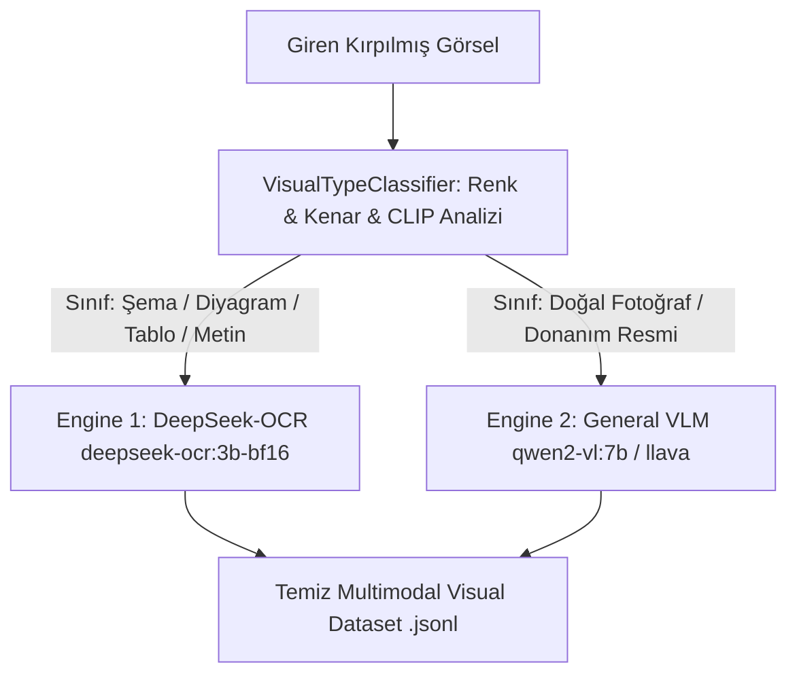

# 🚀 Elektor Universal Pipeline Yol Haritası (ROADMAP)

Bu doküman, **Elektor Universal PDF & Rendergit Synthetic Dataset Platformu**'nun geliştirmelerini, öncelikli mimari hedeflerini ve aşamalı yol haritasını (Roadmap) tanımlar.

---

## 🚨 YÜKSEK ÖNCELİKLİ HEDEF: FAZ-12 Hibrit Çift-VLM Yönlendirme Motoru (Dual-Model Vision Router)

### 📌 Amprisik Problem ve Kök Neden
`test_vision` veri seti incelemelerinde (Bkz. [`tools/viewer.html`](file:///Users/hakankilicaslan/Git/elektor/tools/viewer.html)) tespit edildiği üzere:
- **`deepseek-ocr:3b-bf16` Güçlü Yanları:** Devre şemaları, blok diyagramlar, formüller ve HTML/Markdown tablolarında 2.000+ karakterlik kusursuz teknik anlatım üretmektedir.
- **`deepseek-ocr:3b-bf16` Zayıf Yanları:** Gerçek dünya fotoğraflarında, doğal sahne ve fiziksel donanım resimlerinde piksel glifleri aradığı için `<table>NoneNoneNone</table>` gibi hallusinasyon döngülerine girmektedir.

---

### 🏛️ Mimari Tasarım & Aşamalı Uygulama Planı

#### Aşama 1: Akıllı Görsel Sınıflandırıcı Modülü ([`pipeline/vision_classifier.py`](file:///Users/hakankilicaslan/Git/elektor/pipeline/vision_classifier.py)) [ÖNCELİK: YÜKSEK]
- **Hızlı Sezgisellik (Fast Heuristic Filter):**
  - Renk Kanalları Arası Varyans (RGB Variance): Monokrom/çizim şemaları ile doğal renkli fotoğrafların ayrıştırılması.
  - Kenar Yoğunluğu (Laplacian Variance / Canny Edge Density): Şema çizgileri ile doğal fotoğraf dokularının tespiti.
- **Zero-Shot Classifier (Opsiyonel CLIP / SigLIP):**
  - `["technical schematic circuit diagram table flowchart", "natural photograph hardware physical object photo"]` sınıflaması.

#### Aşama 2: Hibrit Yönlendirici Sürücü ([`pipeline/hybrid_vision_router.py`](file:///Users/hakankilicaslan/Git/elektor/pipeline/hybrid_vision_router.py)) [ÖNCELİK: YÜKSEK]
- Şema ve metin görsellerini `deepseek-ocr:3b-bf16` modeline yönlendirir.
- Gerçek fotoğraf ve nesne görsellerini `qwen2-vl:7b` veya `llava:13b` modeline yönlendirir.
- Üretilen kayıt metadata'sına `"routed_engine": "deepseek-ocr"` veya `"qwen2-vl"` etiketi basar.

#### Aşama 3: Visual Dataset Builder Entegrasyonu ([`pipeline/visual_dataset_builder.py`](file:///Users/hakankilicaslan/Git/elektor/pipeline/visual_dataset_builder.py)) [ÖNCELİK: YÜKSEK]
- `export_multimodal_dataset()` içinde hibrit yönlendiriciyi aktif eder.
- Sharding ve GPU havuzlama ile eşzamanlı çalışacak şekilde izole modül yapısını korur.

#### Aşama 4: Frontend UI Arayüz Kontrolü ([`frontend/src/components/SectionConfig.tsx`](file:///Users/hakankilicaslan/Git/elektor/frontend/src/components/SectionConfig.tsx)) [ÖNCELİK: ORTA]
- Kullanıcıya **"Hibrit Vizyon Yönlendirme (Dual-VLM Router)"** açma/kapama seçeneği sunar.
- İkincil fotoğraf modeli seçimi (`qwen2-vl:7b`, `llava:13b`, `llama3.2-vision`) konfigürasyona bağlanır.

---

## 📅 Genel Proje Yol Haritası Özeti

| Faz | Açıklama | Durum | Öncelik |
| :--- | :--- | :--- | :--- |
| **FAZ-1..9** | Çift-Geçişli Metin Zenginleştirme (OpenAI SDK / Ollama 2x GPU Sharding + TranslateGemma) | **Tamamlandı ✅** | Yüksek |
| **FAZ-10** | Akıllı Düzen Filtreleme (Layout Analyzer, Bounding Box Crop Engine & WebP Optimizer) | **Tamamlandı ✅** | Yüksek |
| **FAZ-11** | Multimodal Visual Dataset Generator (LLaVA / Qwen2-VL formatında ihraç, WebP & Markdown Catalog) | **Tamamlandı ✅** | Yüksek |
| **FAZ-12** | **Hibrit Çift-VLM Yönlendirme Motoru (DeepSeek-OCR + Qwen2-VL / LLaVA)** | **Planlandı 🚨** | **CRITICAL / HIGH** |
| **FAZ-13** | Hugging Face Hub Otomatik Yayınlama ve Cloud GPU Training Kit (Unsloth / Axolotl) | **Tamamlandı ✅** | Orta |
| **FAZ-14** | **Gemini API Sağlamlaştırma (Bağlantı Havuzu, Üstel Geri Çekilme, Token Bütçe Takipçisi & Gemini 3.6/3.5 Flash)** | **Tamamlandı ✅** | **Yüksek** |
| **FAZ-15** | **Bağımsız LLM-as-a-Judge & Editor-in-Chief (Strict Scoring & Cerrahi DPO/SFT Yeniden Yazım)** | **Tamamlandı ✅** | **Yüksek** |
| **FAZ-16** | **LangExtract Kaynak Doğrulama (Grounding), Ofset Hizalama & Dinamik Few-Shot Küratörlüğü** | **Tamamlandı ✅** | **Yüksek** |
| **FAZ-17** | **DeepSeek-OCR Multimodal Markdown Kataloğu & Zengin Görsel Raporlama** | **Tamamlandı ✅** | **Yüksek** |
| **FAZ-18** | **Managed Agents Sandbox Hooks (`pre_tool_execution`, `post_tool_execution`) & Zamanlanmış Tetikleyiciler (Triggers)** | **Tamamlandı ✅** | **Yüksek** |
| **FAZ-19** | **Hugging Face Hub Otomasyonu, Unsloth / Axolotl Cloud Kit & Google Vertex AI Gemini Fine-Tuning Reçetesi** | **Tamamlandı ✅** | **Orta** |
