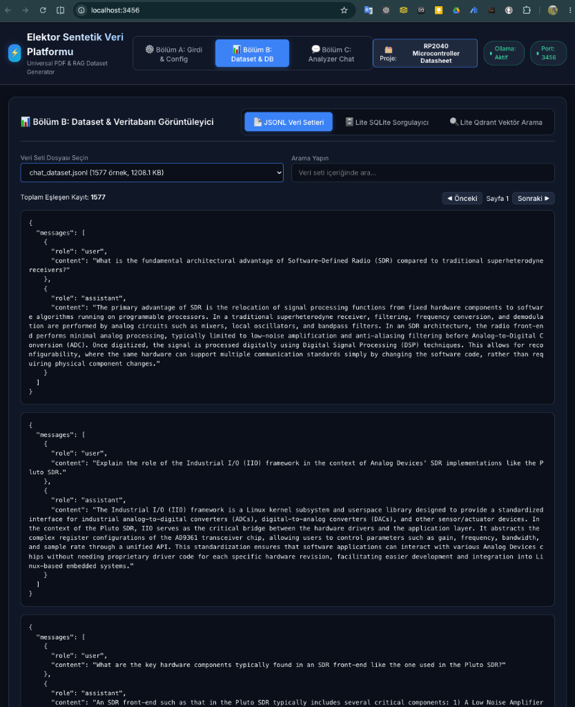

# 🏛️ Türk Tarihi 1931 Ders Kitapları Sentetik Veri Seti (SFT / DPO / Chat)

<p align="center">
  
</p>

Bu veri seti, **1931 yılında Türkiye Cumhuriyeti Maarif Vekaleti (Milli Eğitim Bakanlığı)** tarafından Türk Tarih Tetkik Cemiyeti'ne hazırlatılan ve Devlet Matbaası'nda basılan 4 ciltlik tarihi liseler için ders kitapları arşivinden (*Tarih I: Tarihten Evvelki Zamanlar ve Eski Zamanlar*, *Tarih II: Orta Zamanlar*, *Tarih III: Yeni ve Yakın Zamanlar*, *Tarih IV: Türkiye Cumhuriyeti*) otomatize hatlar üzerinden üretilmiş **Supervised Fine-Tuning (SFT)**, **Direct Preference Optimization (DPO)** ve **Çok Turlu Sohbet (Chat)** sentetik eğitim verilerini içerir.

---

## 🚀 1. Veri İşleme & Boru Hattı (Pipeline) Yöntemleri

Veri seti, **Elektor / Universal PDF & Synthetic Dataset Pipeline** mimarisi kullanılarak yüksek hassasiyetle işlenmiştir:

### 📖 A. Akıllı Çoklu Kitap Bölümleme (Smart Multi-Book Segmentation)
800 sayfaya varan dev PDF ciltlerini tek bir kayıt halinde işleyip anlam kaybı yaşamak yerine; sistem **dijital outline (bookmarks)** ve **basılı Fihrist (İçindekiler) analizcisi** ile dökümanları otomatik olarak 40'tan fazla detaylı bölüm makalesine ayrıştırmıştır.

### 🧹 B. Türkçe OCR Metin Onarım Motoru (OCR Healing Engine)
Taranmış PDF'lerden elde edilen OCR metinleri üzerindeki harf ve dizgi hataları regex tabanlı otomatik iyileştirme motorundan geçirilmiştir:
- **Satır Sonu Tireleme Düzeltmeleri:** `impa- \n ratorluk` ➔ `imparatorluk`.
- **Ek Bütünleme:** Bitişik Türkçe ekler düzenlenmiştir (`-lar/-ler`, `-lık/-lik`, `-den/-dan`, `-liği/-lığı`).
- **Tarihsel Kelime Düzeltmeleri:** Dönemsel OCR hataları otomatik olarak aslına döndürülmüştür:
  - `İkesuslar` ➔ `İksoslar`
  - `Tep devri` ➔ `Teb devri`
  - `inh itat` ➔ `inhitat`
  - `San'at ler` ➔ `Sanatları`

### ⚙️ C. Model & Prompt Sandbox İzolasyonu
Prompt sızıntılarını (örneğin dökümanda tarih anlatılırken donanım/devre şeması yanıtı üretilmesi) engellemek amacıyla LLM modellerine dinamik **Sandbox Parametreleri** enjekte edilmiştir:
- **`llm_persona`**: `"Cumhuriyet dönemi akademik tarih araştırmaları uzmanı ve historiograf"`
- **`llm_subject`**: `"Türk Tarihi, Türk Tarih Tezi, 1931 Ders Kitapları Analizi"`

### 🔄 D. İki Aşamalı Zenginleştirme (Two-Pass Decoupled Pipeline)
- **Pass 1 (Akademik Analiz):** Gemma-4 ve Qwen modelleri ile akademik özet, konu etiketleri, SFT soru-cevap ve DPO tercih çiftleri üretilmiştir.
- **Pass 2 (Dil Uyumlaştırma):** `translategemma:12b` ile dil denetimi ve yüksek kalitede çeviriler yapılmıştır.

---

## 📊 2. Veri Seti Dosya Yapısı & Alt Kümeler

Veri seti `data/` klasörü altında JSONL formatında sunulmaktadır:

| Dosya Adı | Açıklama | Format |
| :--- | :--- | :--- |
| `data/tr_sft_dataset.jsonl` | Türkçe Supervised Fine-Tuning İstem ve Cevap Çiftleri | `{"instruction": "...", "response": "..."}` |
| `data/tr_dpo_dataset.jsonl` | Türkçe Direct Preference Optimization Çiftleri | `{"prompt": "...", "chosen": "...", "rejected": "..."}` |
| `data/tr_chat_dataset.jsonl` | Türkçe Çok Turlu (Multi-turn) Sohbet Çiftleri | `{"messages": [{"role": "user", ...}]}` |
| `data/sft_dataset.jsonl` | İngilizce SFT Çiftleri | `{"instruction": "...", "response": "..."}` |
| `data/dpo_dataset.jsonl` | İngilizce DPO Çiftleri | `{"prompt": "...", "chosen": "...", "rejected": "..."}` |
| `data/chat_dataset.jsonl` | İngilizce Chat Çiftleri | `{"messages": [...]}` |

---

## 💡 3. Kullanım Örnekleri (Python `datasets` Kütüphanesi)

Hugging Face `datasets` kütüphanesi ile veri setini yükleyip doğrudan model eğitimlerinde (LoRA / QLoRA / Alignment) kullanabilirsiniz:

```python
from datasets import load_dataset

# 1. Türkçe SFT Veri Setini Yükleme (tr_sft)
ds_sft = load_dataset("onkanat/turk-tarihi-1931-sft-dpo", "tr_sft")
print("SFT Örnek:")
print(ds_sft["train"][0])

# 2. Türkçe DPO Veri Setini Yükleme (tr_dpo)
ds_dpo = load_dataset("onkanat/turk-tarihi-1931-sft-dpo", "tr_dpo")
print("\nDPO Tercih Edilen (Chosen) vs Reddedilen (Rejected) Örnek:")
print("Prompt:", ds_dpo["train"][0]["prompt"])
print("Chosen:", ds_dpo["train"][0]["chosen"])

# 3. Türkçe Chat Veri Setini Yükleme (tr_chat)
ds_chat = load_dataset("onkanat/turk-tarihi-1931-sft-dpo", "tr_chat")
print("\nChat Diyalog Örnek:")
print(ds_chat["train"][0])
```

---

## 📜 Lisans & Atıf

Bu veri seti, kamuya açık tarihi 1931 basımı eserlerin analizinden türetilmiştir. **Creative Commons Attribution 4.0 International (CC BY 4.0)** lisansı ile yayınlanmıştır.

Veri setini akademik çalışmalarda veya model eğitimlerinizde kullanırken lütfen aşağıdaki şekilde atıfta bulunun:

```bibtex
@dataset{turk_tarihi_1931_sft_dpo,
  author       = {Hakan Kılıçaslan (onkanat)},
  title        = {Türk Tarihi 1931 Ders Kitapları Sentetik Veri Seti (SFT / DPO / Chat)},
  year         = {2026},
  publisher    = {Hugging Face},
  howpublished = {\url{https://huggingface.co/datasets/onkanat/turk-tarihi-1931-sft-dpo}}
}
```
