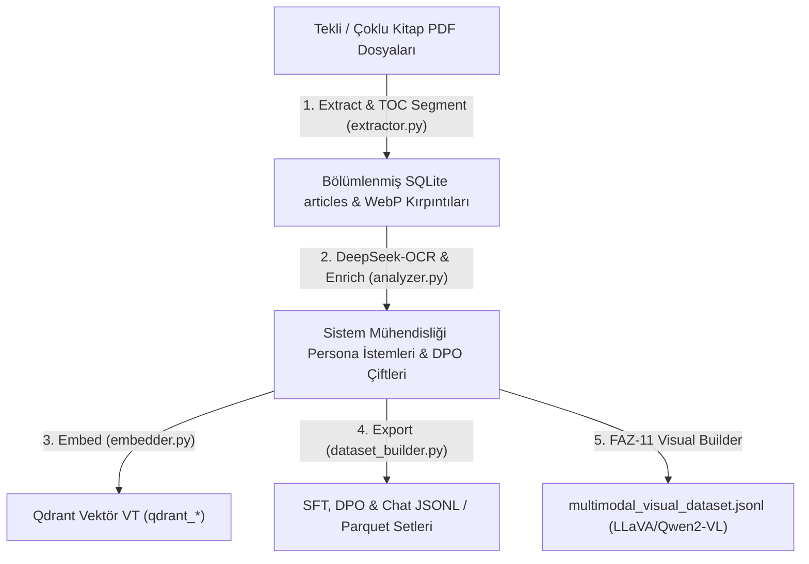

# Book Mode (Tekli veya Çoklu Kitap Bölümleme & Multimodal PDF Motoru)

Bu doküman, projemizin **Book Mode (`input_mode: "book"`)** akıllı kitap bölümleme, PDF sayfa/içindekiler (TOC) analizi ve multimodal sentetik veri seti üretim hattının mimarisini, yaşam döngüsünü ve veritabanı ilişkilerini açıklamaktadır.

---

### 🔄 Book Mode İşlenme Yaşam Döngüsü

---

### 📅 Ne Zaman ve Hangi Aşamada İşleniyor?

#### 1. Kitap Bölümleme ve OCR Çıkarma Evresi (`python run.py extract`)
- `input_mode: "book"` modunda [`pipeline/extractor.py`](file:///Users/hakankilicaslan/Git/elektor/pipeline/extractor.py) altındaki `ArchiveExtractor` tekli veya çoklu PDF kitaplarını işler.
- İçindekiler Tablosu (TOC) taranarak veya akıllı sayfa sınırları algılanarak kitap ana bölümlere (chapters) ayrıştırılır ve SQLite veritabanındaki [`articles`](file:///Users/hakankilicaslan/Git/elektor/pipeline/extractor.py) tablosuna her bölüm bağımsız bir kayıt olarak kaydedilir.
- Sayfalardaki şema, devre şeması ve blok diyagramlar PyMuPDF ile kırpılıp WebP/PNG biçiminde `downloads/extracted_images/` klasörüne aktarılır.

#### 2. Derin Teknik Zenginleştirme Evresi (`python run.py enrich`)
- [`pipeline/analyzer.py`](file:///Users/hakankilicaslan/Git/elektor/pipeline/analyzer.py) içindeki `ArchiveAnalyzer` veritabanındaki her bir kitap bölümünü işler.
- Seçilen Persona (ör. `Professional Systems Engineer`) ve Konu (`Technical Documentation & Architecture`) çerçevesinde:
  - Bölüm Başına Derinlemesine SFT Soru-Cevap Çiftleri
  - DPO (Direct Preference Optimization) Doğrulama Verileri
  - Çok Turlu (Multi-turn) Kod & Şema Tartışma Diyalogları üretilir.

#### 3. Multimodal Vizyon (FAZ-10 & FAZ-11) Evresi (`python run.py export_visual`)
- Kırpılmış çizim ve şemalar DeepSeek-OCR (`deepseek-ocr:3b-bf16`) vizyon modeli üzerinden `<image>\nParse the figure.` resmi istemiyle analiz edilir.
- Çıktılar LLaVA ve Qwen2-VL formatına dönüştürülerek `exports/<project_id>/multimodal_visual_dataset.jsonl` dosyasına yazılır.

#### 4. Vektörleştirme ve İhraç Evresi (`python run.py embed` & `python run.py export`)
- Kitap bölümleri vektörleştirilerek Qdrant veri tabanına yüklenir.
- Sonuçlar `exports/<project_id>/` dizininde yayınlanmaya hazır JSONL ve Parquet formatlarında ihraç edilir.

---

### 📊 Kitap Modu Projelerinizin İşlenme Durumu

Veritabanları ve ihraç klasörleri incelendiğinde örnek Kitap Modu projelerinin durumu şu şekildedir:

| Proje | Kaynak Kitap / PDF Dökümanı | SQLite `articles` (Bölüm) Sayısı | Zenginleştirilmiş QA / Görsel Sayısı | Durum |
| :--- | :--- | :--- | :--- | :--- |
| **`sdr_engineers`** | *Software-Defined Radio for Engineers* | **160 Bölüm/Makale** | **160 Zenginleştirme** | İşlendi & İhraç Edildi ✅ |
| **`test_vision`** | *Booklist - The Mechatronics Handbook* | **861 Bölüm/Makale** | **861 Zenginleştirme + 288+ WebP Görsel** | İşlendi & İhraç Edildi ✅ |

**Özetle:** Kitap modu, ağır teknik kitapları ve dökümanları akıllıca bölümlere ayırarak hem metinsel hem de şematik görseller üzerinden yüksek kaliteli multimodal fine-tuning verisi üretmek üzere tasarlanmıştır.
