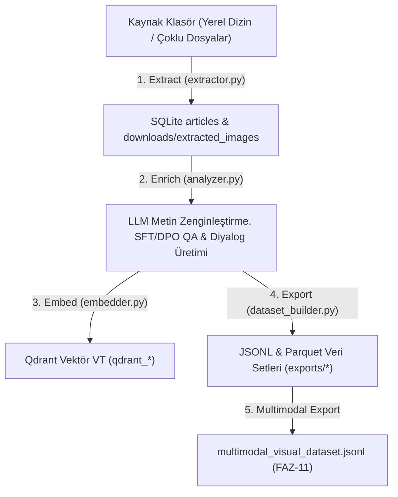

# Folder Mode (Özyinelemeli Klasör İşleme Motoru)

Bu doküman, projemizin **Folder Mode (`input_mode: "folder"`)** özyinelemeli dosya tarama ve sentetik veri seti üretim hattının mimarisini, yaşam döngüsünü ve veritabanı ilişkilerini açıklamaktadır.

---

### 🔄 Folder Mode İşlenme Yaşam Döngüsü

---

### 📅 Ne Zaman ve Hangi Aşamada İşleniyor?

#### 1. Özyinelemeli Çıkarma Evresi (`python run.py extract`)
- `input_mode: "folder"` modunda [`pipeline/extractor.py`](file:///Users/hakankilicaslan/Git/elektor/pipeline/extractor.py) altındaki `ArchiveExtractor` belirlenen hedef klasörü özyinelemeli (recursive) olarak tarar.
- Desteklenen tüm dökümanlar (PDF, TXT, MD, EPUB vb.) okunarak metin parçaları ayrıştırılır ve SQLite veritabanındaki [`articles`](file:///Users/hakankilicaslan/Git/elektor/pipeline/extractor.py) tablosuna aktarılır.
- Dökümanlar içindeki şema, grafik ve çizimler PyMuPDF ile kırpılarak `downloads/extracted_images/` dizinine kaydedilir.

#### 2. Metin & Görsel Zenginleştirme Evresi (`python run.py enrich`)
- [`pipeline/analyzer.py`](file:///Users/hakankilicaslan/Git/elektor/pipeline/analyzer.py) içindeki `ArchiveAnalyzer` veritabanındaki her bir makaleyi/metni işler.
- LLM (`model_analyzer` / `model_translator`) ve DeepSeek-OCR vizyon modelleri aracılığıyla:
  - Çift Dilli (Bilingual) Metin Zenginleştirme
  - Pragmatik SFT (Supervised Fine-Tuning) Soru-Cevap Çiftleri
  - DPO (Direct Preference Optimization) Doğrulama İkilileri
  - Çok Turlu (Multi-turn) Diyalog Dizileri üretilir.

#### 3. Vektörleştirme ve İhraç Evresi (`python run.py embed` & `python run.py export`)
- İşlenen metinler `chunk_size: 800` ve `chunk_overlap: 150` parametreleriyle parçalanıp `nomic-embed-text` modeliyle vektörleştirilerek Qdrant veritabanına yüklenir.
- Sonuçlar `exports/<project_id>/` altında `sft_dataset.jsonl`, `tr_sft_dataset.jsonl`, `dpo_dataset.jsonl`, `chat_dataset.jsonl` ve `multimodal_visual_dataset.jsonl` biçiminde ihraç edilir.

---

### 📊 Klasör Modu Projelerinizin İşlenme Durumu

Veritabanları ve ihraç klasörleri incelendiğinde örnek Klasör Modu projelerinin durumu şu şekildedir:

| Proje | Kaynak Veri / Hedef Klasör | SQLite `articles` Sayısı | Zenginleştirilmiş QA Sayısı | Durum |
| :--- | :--- | :--- | :--- | :--- |
| **`rapberry_pi_pico_all`** | Raspberry Pi Pico Kod & Dokümantasyon Klasörü | **843 Makale** | **843 Zenginleştirme** | İşlendi & İhraç Edildi ✅ |
| **`octave`** | Octave Sayısal Analiz Kod Deposu | **382 Makale** | **382 Zenginleştirme** | İşlendi & İhraç Edildi ✅ |
| **`türk`** | Türk Tarih Seti Doküman Klasörü | **414 Makale** | **414 Zenginleştirme** | İşlendi & İhraç Edildi ✅ |

**Özetle:** Klasör modu, hiyerarşik veya karışık dosya yapılarını özyinelemeli tarayarak yüksek kalitede sentetik veri seti oluşturmak üzere tam entegre biçimde çalışmaktadır.
