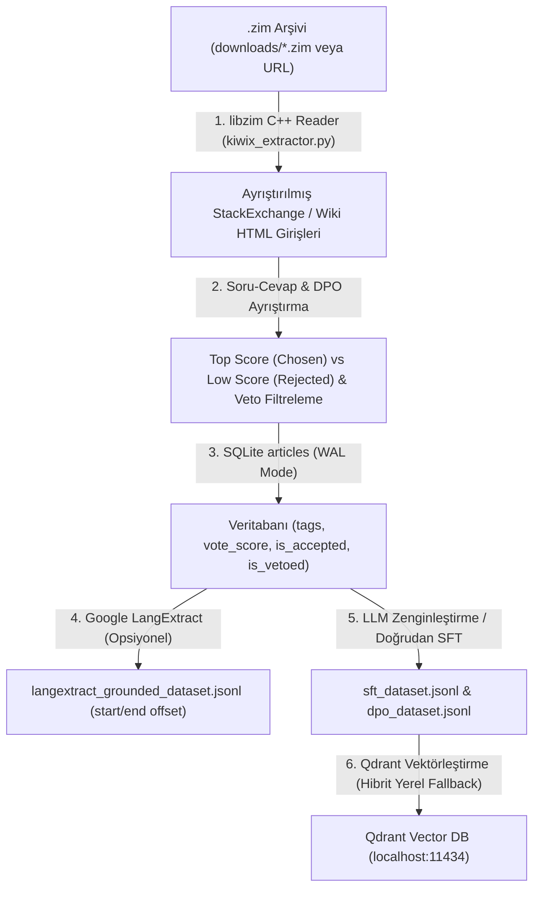

# Kiwix ZIM Mode (Kompakt ZIM Arşivleri & StackExchange Soru-Cevap Motoru)

Bu doküman, projemizin **Kiwix ZIM Mode (`input_mode: "kiwix"` / `"zim"`)** mimarisini, StackExchange/Wikipedia ZIM arşivlerinden doğrudan veri çıkarma yaşam döngüsünü, otomatik DPO/SFT eşleştirme algoritmalarını ve Web UI entegrasyonunu açıklamaktadır.

---

### 🔄 Kiwix ZIM Mode İşlenme Yaşam Döngüsü



---

### 📅 Ne Zaman ve Hangi Aşamada İşleniyor?

#### 1. ZIM İndirme ve Doğrudan Çıkarma Evresi (`python run.py extract` / `python run.py kiwix`)
- `input_mode: "kiwix"` seçildiğinde [`pipeline/kiwix_extractor.py`](file:///Users/hakankilicaslan/Git/elektor/pipeline/kiwix_extractor.py) devreye girer.
- `input_path` olarak verilen yerel dosya yolu veya Kiwix HTTP indirme bağlantısı taranır (dosya yerelde yoksa otomatik indirilir).
- `libzim.Archive` üzerinden doğrudan bellekten ZIM blokları taranır (arşivin diske açılmasına gerek kalmaz).

#### 2. StackExchange ve Wiki HTML Ayrıştırma
- **StackExchange Formatı:** Soru başlığı, soru gövdesi, etiketler (`tags`), yanıtlar, kabul edilen çözüm (`is_accepted`) ve kullanıcı oyları (`vote_score`) ayıklanır.
- **Otomatik DPO Çifti Üretimi:**
  - `Chosen Response`: Kabul edilen çözüm veya en yüksek oy alan yanıt (min oy: `kiwix_min_chosen_score`).
  - `Rejected Response`: En düşük oy alan alternatif yanıt (aradaki fark: `kiwix_min_vote_diff`).
  - `Veto Filtresi`: Kapatılmış, kurallara aykırı veya eksi oy almış yanıtlar otomatik olarak rejected kümesine atanır ya da elenir.
- **Wiki Formatı:** Temizlenmiş ansiklopedik makale metinleri ve teknik bölümler ayıklanır.

#### 3. Toplu İşleme ve Dilim (Slice) Desteği
- `--limit` parametresi hem tamsayı (`--limit 5`) hem de parça/dilim (`--limit 6:11`, `--limit 100:200`) aralıklarını destekler.
- `--batch-size` parametresiyle SQLite'a çoklu commit (`executemany`) yapılır (varsayılan: 50).

#### 4. Hibrit LLM & Yerel Vektörleştirme (Embedding)
- LLM analizi için bulut modelleri (`https://ollama.com/v1` - `minimax-m3`) seçilmiş olsa bile, `pipeline/llm_client.py` içerisindeki `get_embedding_client` katmanı embedding isteklerini otomatik olarak **yerel `http://localhost:11434/v1` (`nomic-embed-text`)** sunucusuna yönlendirir.

---

### ⚙️ Yapılandırma Parametreleri (`config.json` & `projects_extract.json`)

```json
{
  "project_id": "extract",
  "input_mode": "kiwix",
  "input_path": "/Users/.../downloads/ham.stackexchange.com_en_all_2026-02.zim",
  "kiwix_extract_mode": "auto",
  "kiwix_min_chosen_score": 1,
  "kiwix_min_vote_diff": 2,
  "kiwix_batch_size": 50,
  "ollama_url": "https://ollama.com/v1",
  "embedding_url": "http://localhost:11434/v1",
  "model_analyzer": "minimax-m3",
  "model_embedding": "nomic-embed-text:latest",
  "analyzer_max_tokens": 4096,
  "sft_qa_count": 6
}
```

| Parametre | Tip | Varsayılan | Açıklama |
| :--- | :---: | :---: | :--- |
| `input_mode` | `string` | `"folder"` | `"kiwix"` veya `"zim"` girilmelidir. |
| `input_path` | `string` | `""` | Yerel `.zim` dosya yolu veya indirme URL'si. |
| `kiwix_extract_mode` | `string` | `"auto"` | `"auto"`, `"stackexchange"`, `"wiki"`. |
| `kiwix_min_chosen_score` | `number` | `1` | DPO Chosen için gereken minimum net oy puanı. |
| `kiwix_min_vote_diff` | `number` | `2` | Chosen ile Rejected yanıt arasındaki minimum oy puan farkı. |
| `kiwix_batch_size` | `number` | `50` | SQLite toplu ekleme (bulk insert) boyutu. |
| `embedding_url` | `string` | `"http://localhost:11434/v1"` | Vektörleştirme için yerel Ollama/OpenAI uyumlu uç nokta. |

---

### 🖥️ Web UI (Frontend) Entegrasyonu

Kiwix ZIM yetenekleri React frontend arayüzüne tam entegre edilmiştir:

1. **Konfigürasyon Formu (`SectionConfig.tsx` & `ConfigEditorModal.tsx`):**
   - Girdi Modu olarak `Kiwix ZIM (.zim Arşivi)` seçilebilir.
   - Çıkarma modu, batch boyutu ve DPO oy delta eşikleri form üzerinden ayarlanabilir.
2. **Veri Seti Görüntüleyici (`SectionDatasetViewer.tsx`):**
   - SQLite ve JSONL tablolarında `#tag` etiket hapları (badge), `▲ oy puanı`, `✓ Kabul Edildi` ve `🚫 Veto/Kapatılmış` göstergeleri.
   - Detay modalında KaTeX matematiksel formül desteği, DPO `Chosen Score` vs `Rejected Score` karşılaştırma kartları.

---

### 💻 Komut Satırı Kullanımı (CLI Examples)

```bash
# İlk 5 makaleyi test olarak çıkart
python run.py kiwix --limit 5

# Belirli bir aralığı (parçalı) çıkart
python run.py extract --limit 6:11

# Tüm boru hattını (Kiwix Çıkarma -> Zenginleştirme -> Vektör -> İhraç) çalıştır
python run.py pipeline --limit 5 --reset

# Bağımsız ZIM çıkarma ve LangExtract çalıştırma
python run.py kiwix --mode stackexchange --batch-size 100
```
