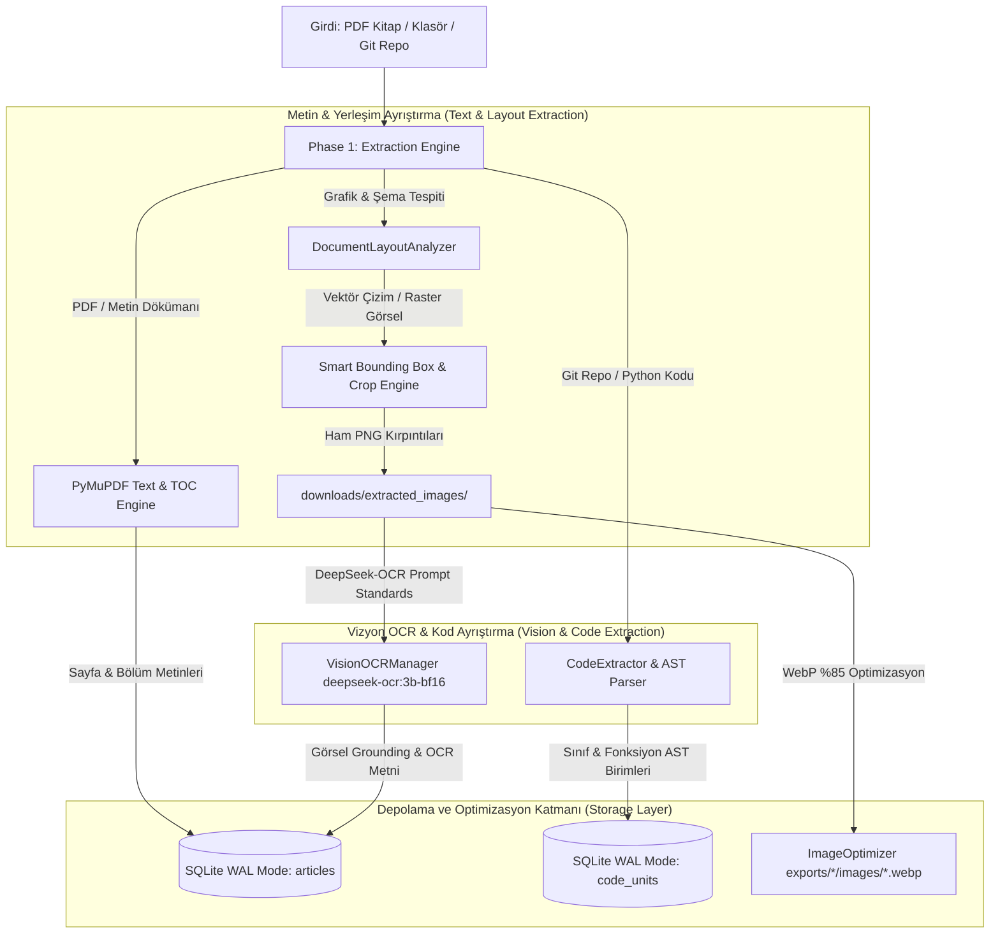

# Phase 1: Metin & Vizyon Çıkarma Mimarisi (Extraction Pipeline Architecture)

Bu doküman, projemizin **Phase 1: Metin & Vizyon Çıkarma (Extraction Pipeline)** evresinin sistem mimarisini, veri akışını, bileşen sorumluluklarını ve veritabanı depolama şemalarını detaylıca açıklamaktadır.

---

### 🏗️ Phase 1 Mimarisi ve Veri Akışı

Phase 1; PDF kitaplarını, teknik dökümanları, yerel dosya klasörlerini ve Python Git kod depolarını ayrıştırarak yapılandırılmış metin dilimleri, görsel şemalar ve AST kod birimleri halinde SQLite veritabanına kaydeder.



---

### 🛠️ Phase 1 Temel Modülleri ve Sorumlulukları

| Modül / Sürücü | Sorumluluk & Çalışma Prensibi |
| :--- | :--- |
| **[`pipeline/extractor.py`](file:///Users/hakankilicaslan/Git/elektor/pipeline/extractor.py)** | **`ArchiveExtractor`**: PDF, TXT, MD ve EPUB dökümanlarını ayrıştırır, İçindekiler Tablosu (TOC) ve sayfa sınırları üzerinden bölümlere ayırarak `articles` tablosuna indeksler. |
| **[`pipeline/layout_analyzer.py`](file:///Users/hakankilicaslan/Git/elektor/pipeline/layout_analyzer.py)** | **`DocumentLayoutAnalyzer`**: PDF sayfalarındaki vektör çizimleri (`get_drawings()`) ve raster görselleri (`get_images()`) bounding-box (sınırlayıcı kutu) ve altyazı bağlamı (caption context) ile tespit edip `downloads/extracted_images/` klasörüne kırpar. |
| **[`pipeline/vision_ocr.py`](file:///Users/hakankilicaslan/Git/elektor/pipeline/vision_ocr.py)** | **`VisionOCRManager`**: DeepSeek-OCR (`deepseek-ocr:3b-bf16`) vizyon sürücüsü. Resmi `<image>\nParse the figure.` ve `<image>\n<|grounding|>` istemleriyle devre şemaları ve çizimlerden metinsel/grafiksel grounding çıktısı üretir. |
| **[`pipeline/code_extractor.py`](file:///Users/hakankilicaslan/Git/elektor/pipeline/code_extractor.py)** | **`CodeExtractor`**: Git depolarını Andrej Karpathy'nin `rendergit` metodolojisiyle tek bir Markdown dosyasında düzleştirir. Python AST (`ast.parse`) ile `class` ve `def` birimlerini ayırarak `code_units` tablosuna kaydeder. |
| **[`pipeline/image_optimizer.py`](file:///Users/hakankilicaslan/Git/elektor/pipeline/image_optimizer.py)** | **`ImageOptimizer`**: Kırpılmış ham PNG dosyalarını maksimum 1024px çözünürlük sınırı ve %85 WebP kalitesiyle sıkıştırarak `exports/<project_id>/images/` altına aktarır. Depolamadan %90 tasarruf sağlar. |

---

### 🗄️ Veritabanı Şemaları (SQLite WAL Mode)

Phase 1 çıktısı olan metinler ve kodlar, eşzamanlı okuma/yazma emniyeti için SQLite WAL (`PRAGMA journal_mode=WAL;`) modunda saklanır.

#### 1. `articles` Tablosu Şeması (Dökümanlar & Kitap Bölümleri)
```sql
CREATE TABLE articles (
    id TEXT PRIMARY KEY,
    title TEXT,
    content TEXT,
    source_file TEXT,
    word_count INTEGER,
    char_count INTEGER,
    ocr_applied BOOLEAN DEFAULT 0,
    images_extracted INTEGER DEFAULT 0,
    created_at TIMESTAMP DEFAULT CURRENT_TIMESTAMP
);
```

#### 2. `code_units` Tablosu Şeması (AST Kod Birimleri)
```sql
CREATE TABLE code_units (
    id TEXT PRIMARY KEY,
    file_path TEXT,
    unit_type TEXT, -- 'class', 'function', 'method'
    unit_name TEXT,
    code_content TEXT,
    start_line INTEGER,
    end_line INTEGER,
    created_at TIMESTAMP DEFAULT CURRENT_TIMESTAMP
);
```

---

### 🖼️ Görsel Depolama & Güvenlik Politikası

1. **WebP Optimizasyonu & Disk Koruması:**
   - Ham PNG kırpıntıları (5MB+) WebP formatında **7KB - 17KB** seviyesine düşürülür.
   - `--clear` parametresi kullanılmadığı sürece ham görseller `downloads/extracted_images/` klasöründe güvenlik amacıyla muhafaza edilir.
2. **Gizlilik Garantisi:**
   - Ham PDF dosyaları ve çıkarılan yerel veritabanları (`database/*.db`) kullanıcı onayı olmadan dış ağlara gönderilmez.

---

### 📊 Phase 1 İstatistikleri ve İhraç Durumu

Projelerde Phase 1 extraction adımı sonunda elde edilen veritabanı büyüklükleri:

| Proje | Girdi Modu | Ayrıştırılan Metin / Bölüm | Çıkarılan AST Kod Birimi | Kırpılan Şema / Görsel |
| :--- | :--- | :--- | :--- | :--- |
| **`test_vision`** | Book Mode (PDF) | **861 Bölüm** | - | **634 WebP Görsel** |
| **`sdr_engineers`** | Book Mode (PDF) | **160 Bölüm** | - | **45 Görsel** |
| **`rapberry_pi_pico_all`** | Folder Mode | **843 Makale** | - | **120+ Görsel** |
| **`rendergit_merged_all`** | Rendergit Mode (Git) | **3 Master Makale** | **499 Kod Birimi** | - |

**Özetle:** Phase 1 metin ve vizyon çıkarma mimarisi, kaynak bağımsız olarak (PDF, Klasör, Git Repo) tüm veriyi sonraki sentetik LLM zenginleştirme (Phase 2) evresine tam uyumlu standart veritabanı şemalarına dönüştürmektedir.
