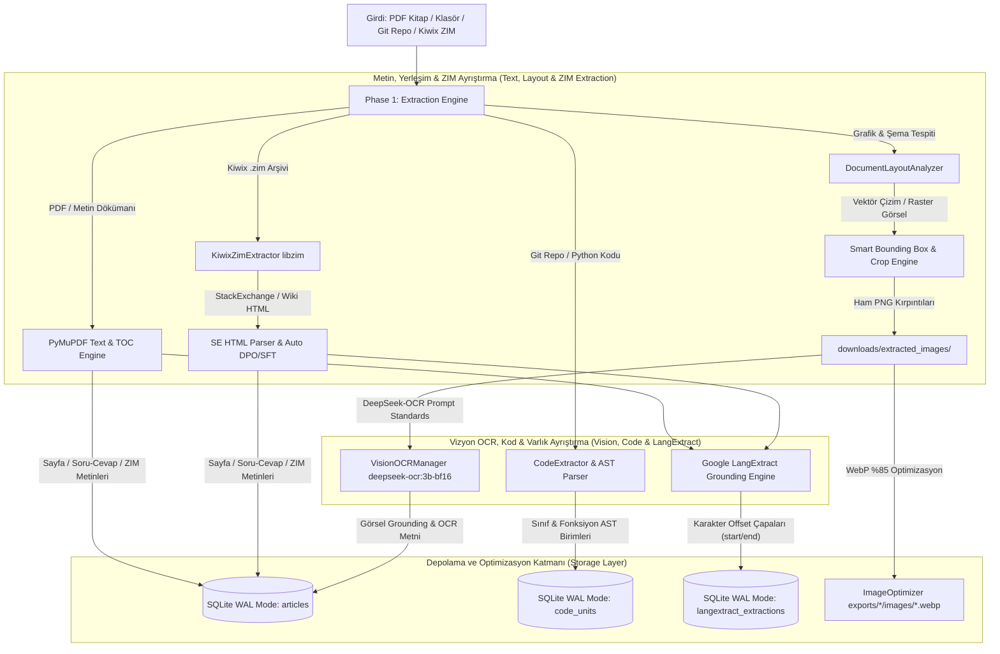

# Phase 1: Metin & Vizyon Çıkarma Mimarisi (Extraction Pipeline Architecture)

Bu doküman, projemizin **Phase 1: Metin & Vizyon Çıkarma (Extraction Pipeline)** evresinin sistem mimarisini, veri akışını, bileşen sorumluluklarını ve veritabanı depolama şemalarını detaylıca açıklamaktadır.

---

### 🏗️ Phase 1 Mimarisi ve Veri Akışı

Phase 1; PDF kitaplarını, teknik dökümanları, yerel dosya klasörlerini, Python Git kod depolarını ve **Kiwix ZIM (.zim) arşivlerini (StackExchange / Wikipedia)** ayrıştırarak yapılandırılmış metin dilimleri, görsel şemalar, AST kod birimleri ve soru-cevap çiftleri halinde SQLite veritabanına kaydeder.



---

### 🛠️ Phase 1 Temel Modülleri ve Sorumlulukları

| Modül / Sürücü | Sorumluluk & Çalışma Prensibi |
| :--- | :--- |
| **[`pipeline/extractor.py`](file:///Users/hakankilicaslan/Git/elektor/pipeline/extractor.py)** | **`ArchiveExtractor`**: PDF, TXT, MD, EPUB dökümanlarını ayrıştırır, İçindekiler Tablosu (TOC) ve sayfa sınırları üzerinden bölümlere ayırarak `articles` tablosuna indeksler. |
| **[`pipeline/kiwix_extractor.py`](file:///Users/hakankilicaslan/Git/elektor/pipeline/kiwix_extractor.py)** | **`KiwixZimExtractor`**: `libzim` C++ API ile sıkıştırılmış `.zim` arşivlerini (StackExchange / Wikipedia) doğrudan bellekten tarar. Soru-cevap hiyerarşisini, etiketleri (`tags`), oy skorlarını (`vote_score`) ve kabul edilen çözümleri (`is_accepted`) parse ederek doğrudan SFT/DPO çiftleri üretir. |
| **[`pipeline/layout_analyzer.py`](file:///Users/hakankilicaslan/Git/elektor/pipeline/layout_analyzer.py)** | **`DocumentLayoutAnalyzer`**: PDF sayfalarındaki vektör çizimleri (`get_drawings()`) ve raster görselleri (`get_images()`) bounding-box (sınırlayıcı kutu) ve altyazı bağlamı (caption context) ile tespit edip `downloads/extracted_images/` klasörüne kırpar. |
| **[`pipeline/vision_ocr.py`](file:///Users/hakankilicaslan/Git/elektor/pipeline/vision_ocr.py)** | **`VisionOCRManager`**: DeepSeek-OCR (`deepseek-ocr:3b-bf16`) vizyon sürücüsü. Resmi `<image>\nParse the figure.` ve `<image>\n<|grounding|>` istemleriyle devre şemaları ve çizimlerden metinsel/grafiksel grounding çıktısı üretir. |
| **[`pipeline/code_extractor.py`](file:///Users/hakankilicaslan/Git/elektor/pipeline/code_extractor.py)** | **`CodeExtractor`**: Git depolarını Andrej Karpathy'nin `rendergit` metodolojisiyle tek bir Markdown dosyasında düzleştirir. Python AST (`ast.parse`) ile `class` ve `def` birimlerini ayırarak `code_units` tablosuna kaydeder. |
| **[`pipeline/langextract_engine.py`](file:///Users/hakankilicaslan/Git/elektor/pipeline/langextract_engine.py)** | **`LangExtractEngine`**: Google LangExtract ile metinler içindeki bileşen, formül ve devre parametrelerini tam karakter aralıklarıyla (`start_char`, `end_char`) etiketler ve `langextract_extractions` tablosuna kaydeder. |
| **[`pipeline/image_optimizer.py`](file:///Users/hakankilicaslan/Git/elektor/pipeline/image_optimizer.py)** | **`ImageOptimizer`**: Kırpılmış ham PNG dosyalarını maksimum 1024px çözünürlük sınırı ve %85 WebP kalitesiyle sıkıştırarak `exports/<project_id>/images/` altına aktarır. Depolamadan %90 tasarruf sağlar. |

---

### 🗄️ Veritabanı Şemaları (SQLite WAL Mode)

Phase 1 çıktısı olan metinler, kodlar ve grounding varlıkları eşzamanlı okuma/yazma emniyeti için SQLite WAL (`PRAGMA journal_mode=WAL;`) modunda saklanır.

#### 1. `articles` Tablosu Şeması (Dökümanlar, Kitap Bölümleri & Kiwix ZIM Girişleri)
```sql
CREATE TABLE IF NOT EXISTS articles (
    id INTEGER PRIMARY KEY AUTOINCREMENT,
    file_path TEXT UNIQUE,
    filename TEXT,
    title TEXT,
    year INTEGER,
    zoom_snippet TEXT,
    extracted_text TEXT,
    is_ocr INTEGER DEFAULT 0,
    is_enriched INTEGER DEFAULT 0,
    is_embedded INTEGER DEFAULT 0,
    processed_at TEXT,
    source_type TEXT DEFAULT 'pdf',    -- 'pdf', 'book', 'folder', 'git_repo', 'stackexchange', 'wiki'
    tags TEXT DEFAULT '[]',             -- JSON listesi: ["#ham-radio", "#antenna"]
    vote_score INTEGER DEFAULT 0,       -- StackExchange net oy skoru
    is_accepted INTEGER DEFAULT 0,      -- Kabul edilmiş çözüm bayrağı (1/0)
    is_vetoed INTEGER DEFAULT 0,        -- Kapatılmış/veto edilmiş soru bayrağı (1/0)
    metadata_json TEXT DEFAULT '{}'     -- Detaylı ZIM / SFT / DPO soru-cevap üstverisi
);
```

#### 2. `code_units` Tablosu Şeması (AST Kod Birimleri)
```sql
CREATE TABLE IF NOT EXISTS code_units (
    id INTEGER PRIMARY KEY AUTOINCREMENT,
    project_id TEXT,
    file_path TEXT,
    unit_type TEXT,                     -- 'class', 'function', 'async_function'
    name TEXT,
    docstring TEXT,
    code_content TEXT,
    line_start INTEGER,
    line_end INTEGER,
    created_at TEXT
);
```

#### 3. `langextract_extractions` Tablosu Şeması (Google LangExtract Çapaları)
```sql
CREATE TABLE IF NOT EXISTS langextract_extractions (
    id INTEGER PRIMARY KEY AUTOINCREMENT,
    article_id INTEGER,
    schema_preset TEXT,
    provider TEXT,
    extracted_entities_json TEXT,       -- [{"text_span": "...", "start_char": 12, "end_char": 25, "attributes": {...}}]
    created_at TEXT,
    FOREIGN KEY(article_id) REFERENCES articles(id)
);
```

---

### 🖼️ Görsel Depolama & Güvenlik Politikası

1. **WebP Optimizasyonu & Disk Koruması:**
   - Ham PNG kırpıntıları (5MB+) WebP formatında **7KB - 17KB** seviyesine düşürülür.
   - `--clear` parametresi kullanılmadığı sürece ham görseller `downloads/extracted_images/` klasöründe güvenlik amacıyla muhafaza edilir.
2. **Gizlilik Garantisi:**
   - Ham PDF/ZIM dosyaları ve çıkarılan yerel veritabanları (`database/*.db`) kullanıcı onayı olmadan dış ağlara gönderilmez.

---

### 📊 Phase 1 İstatistikleri ve İhraç Durumu

Projelerde Phase 1 extraction adımı sonunda elde edilen veritabanı büyüklükleri:

| Proje | Girdi Modu | Ayrıştırılan Metin / Bölüm | Çıkarılan AST Kod / ZIM Soru-Cevap | Kırpılan Şema / Görsel |
| :--- | :--- | :--- | :--- | :--- |
| **`test_extract` (Kiwix)** | Kiwix ZIM Mode (.zim) | **24+ ZIM Girişi** | **93 SFT + 20 DPO + 606 LangExtract** | - |
| **`test_vision`** | Book Mode (PDF) | **861 Bölüm** | - | **634 WebP Görsel** |
| **`sdr_engineers`** | Book Mode (PDF) | **160 Bölüm** | - | **45 Görsel** |
| **`rapberry_pi_pico_all`** | Folder Mode | **843 Makale** | - | **120+ Görsel** |
| **`rendergit_merged_all`** | Rendergit Mode (Git) | **3 Master Makale** | **499 Kod Birimi** | - |

**Özetle:** Phase 1 metin, kod ve ZIM çıkarma mimarisi; PDF, Klasör, Git Deposu ve Kiwix ZIM arşivleri dahil tüm veri kaynaklarını sentetik LLM zenginleştirme (Phase 2) ve doğrudan fine-tuning aşamalarına hazır standart veri yapılarına dönüştürmektedir.
