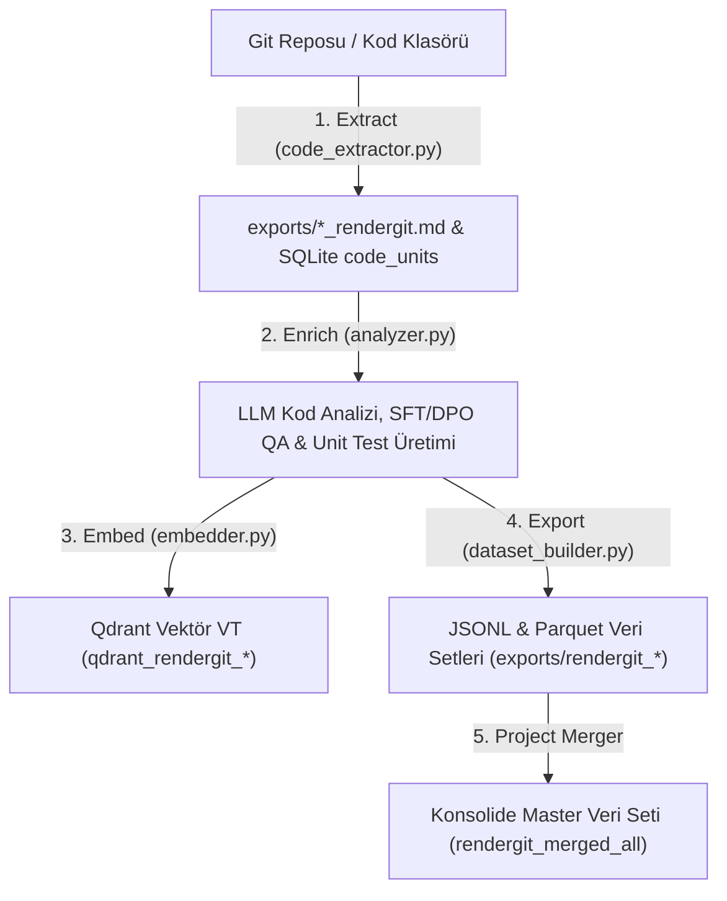

Searched for "rendergit"
Ran command: `PYTHONUNBUFFERED=1 PYTHONPATH=. uv run python -c "
import sqlite3, os
for db in ['rendergit_01.db', 'rendergit_02.db', 'rendergit_03.db', 'rendergit_merged_all.db']:
    p = os.path.join('database', db)
    if os.path.exists(p):
        conn = sqlite3.connect(p)
        cur = conn.cursor()
        cur.execute(\"SELECT count(*) FROM sqlite_master WHERE type='table' AND name='code_units'\")
        has_table = cur.fetchone()[0]
        units_count = 0
        if has_table:
            cur.execute('SELECT count(*) FROM code_units')
            units_count = cur.fetchone()[0]
        cur.execute(\"SELECT count(*) FROM sqlite_master WHERE type='table' AND name='articles'\")
        has_articles = cur.fetchone()[0]
        articles_count = 0
        if has_articles:
            cur.execute('SELECT count(*) FROM articles')
            articles_count = cur.fetchone()[0]
        conn.close()
        print(f'{db}: code_units={units_count}, articles/QA={articles_count}')
    else:
        print(f'{db}: File not found')
"`
Ran command: `PYTHONUNBUFFERED=1 PYTHONPATH=. uv run python -c "
import os
for folder in ['rendergit_01', 'rendergit_02', 'rendergit_03', 'rendergit_merged_all']:
    p = os.path.join('exports', folder)
    if os.path.exists(p):
        files = os.listdir(p)
        print(f'{folder}: {files}')
"`

İşaret ettiğiniz `*_rendergit.md` dosyaları, projemizin **Rendergit Kod Veri Seti Üretim Hattı**'nın en temel kaynak dokümanlarıdır.

Bu dosyaların üretimi, işlenme zamanları ve yaşam döngüsü aşağıdaki gibi çalışmaktadır:

---

### 🔄 Rendergit Dosyalarının İşlenme Yaşam Döngüsü

---

### 📅 Ne Zaman ve Hangi Aşamada İşleniyor?

#### 1. Çıkarma ve Düzleştirme Evresi (`python run.py extract`)

- `input_mode: "rendergit"` komutu verildiğinde, Andrej Karpathy'nin `rendergit` metodolojisi ile tüm Python kaynak kodları tek bir birleşik Markdown dokümanında ([`exports/rendergit_01_rendergit.md`](file:///Users/hakankilicaslan/Git/elektor/exports/rendergit_01_rendergit.md)) düzleştirilir.
- Aynı anda Python AST (Soyut Sentaks Ağacı) analizi yapılarak tüm fonksiyonlar, sınıflar ve metotlar ayrıştırılıp SQLite veritabanındaki `code_units` tablosuna yazılır.

#### 2. Zenginleştirme ve Sentetik Veri Üretimi (`python run.py enrich`)

- `analyzer.py` modülü bu `_rendergit.md` dosyasını ve `code_units` tablosunu okur.
- LLM (`model_analyzer` / `model_translator`) kullanarak:
  - Kod Açıklama (Code Explanation)
  - Kod Tamamlama (Code Completion)
  - Hata Düzeltme (Bug Fix)
  - Birim Test Üretimi (Unit Test Generation)
  - Türkçe/İngilizce Teknik QA çiftleri oluşturur.

#### 3. İhraç ve Birleştirme Evresi (`python run.py export` / `ProjectMerger`)

- İşlenen veriler `exports/rendergit_01/` vb. dizinler altında `code_sft_dataset.jsonl`, `dpo_dataset.jsonl` ve `chat_dataset.jsonl` olarak ihraç edilir.

---

### 📊 Mevcut Projelerinizin İşlenme Durumu

Veritabanları ve ihraç klasörleri incelendiğinde bu 3 dosyanın işlenme durumu şu şekildedir:

| Proje | Düzleştirilmiş Markdown Dosyası | SQLite `code_units` Sayısı | Durum |
| :--- | :--- | :--- | :--- |
| **`rendergit_01`** | [`rendergit_01_rendergit.md`](file:///Users/hakankilicaslan/Git/elektor/exports/rendergit_01_rendergit.md) (22.9 KB) | **28 Kod Birimi** | İşlendi & İhraç Edildi ✅ |
| **`rendergit_02`** | [`rendergit_02_rendergit.md`](file:///Users/hakankilicaslan/Git/elektor/exports/rendergit_02_rendergit.md) (1.03 MB) | **431 Kod Birimi** | İşlendi & İhraç Edildi ✅ |
| **`rendergit_03`** | [`rendergit_03_rendergit.md`](file:///Users/hakankilicaslan/Git/elektor/exports/rendergit_03_rendergit.md) (73.1 KB) | **40 Kod Birimi** | İşlendi & İhraç Edildi ✅ |
| **`rendergit_merged_all`** | [`rendergit_merged_all_rendergit.md`](file:///Users/hakankilicaslan/Git/elektor/exports/rendergit_merged_all_rendergit.md) | **499 Kod Birimi** (Konsolide) | Birleştirilmiş Master Veri Seti ✅ |

**Özetle:** Bu 3 dosya projenizde başarıyla işlenmiş, AST analizleri yapılmış ve `rendergit_merged_all` master projesinde **499 kod birimi** olarak birleştirilip hazır hale getirilmiştir.
